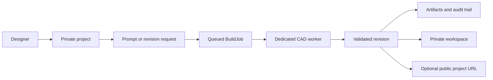
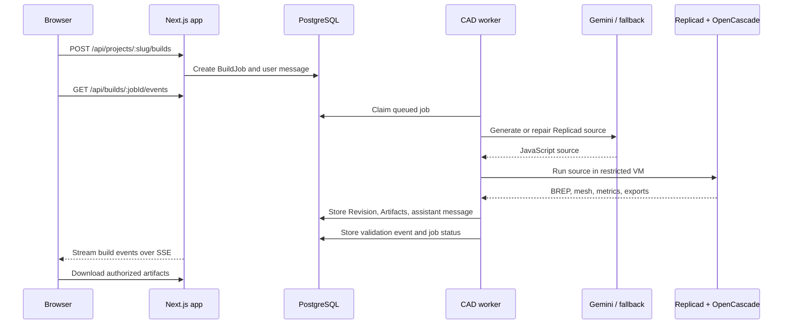
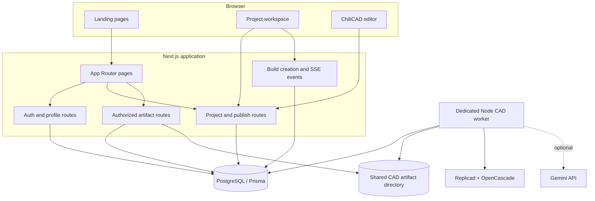
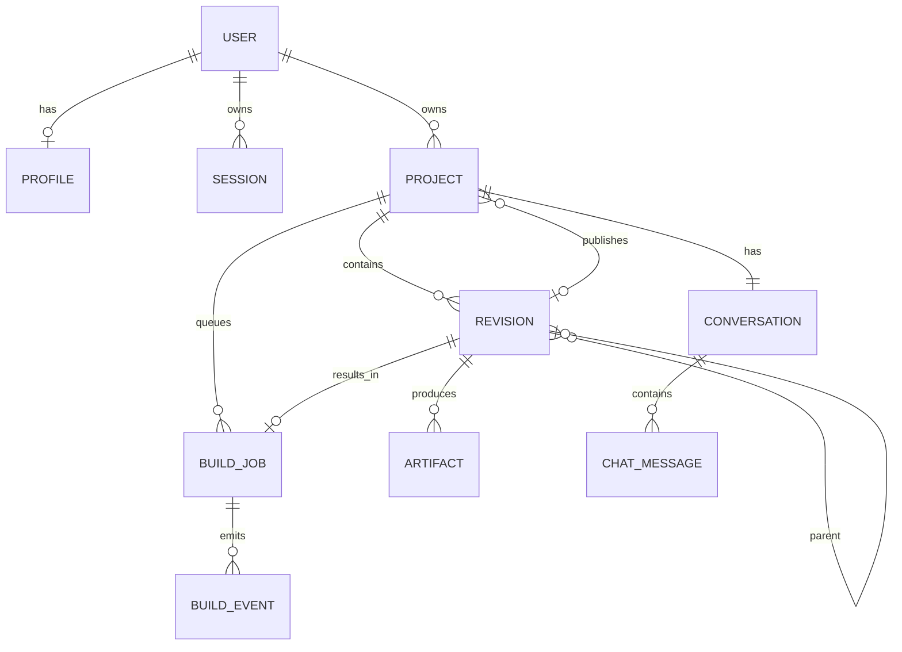

# Agentic CAD

Agentic CAD turns a design brief into a validated, editable OpenCascade BREP. A project keeps the engineering record around every result: the original prompt, structured intent, parametric plan, generated Replicad source, validation report, preview mesh, STEP, STL, audit JSON, and the conversation that explains each revision.

The application is a Next.js 15 / React 19 product with a PostgreSQL database accessed through Prisma. CAD generation is designed to run in a separate Node.js worker, while the web application owns authentication, project state, artifact authorization, and the live activity feed.

## Product flow



The durable unit is a `Project`. Each build creates a numbered `Revision` linked to an optional parent revision, so an edit can preserve the previous source and geometry lineage. A revision is publishable only when deterministic validation marks it valid.

## Agent and geometry pipeline



The worker stages are:

1. Intent extraction creates a compact engineering intent object in millimetres.
2. Parametric planning selects editable primitives and their feature order.
3. Code generation uses the verified local Replicad API reference. If `GEMINI_API_KEY` is absent, a small built-in template fallback is used.
4. The build runtime executes generated code in a Node VM with string and WebAssembly code generation disabled. It blocks imports, process access, networking, timers, dynamic evaluation, and similar identifiers.
5. Replicad/OpenCascade produces BREP-derived measurements and exports. Raw triangle meshes are supported for preview/STL, but are not included in STEP.
6. Validation checks usable volume/triangles, part count, triangle budget, disconnected parts, and export warnings. Failed builds may receive two repair attempts after the initial build.

## Architecture



### Main code areas

| Area | Location | Responsibility |
| --- | --- | --- |
| App Router pages | `app/` | Landing, auth, projects, public profiles, workspace, and ChiliCAD entry points |
| HTTP API | `app/api/` | Sessions, projects, builds, SSE events, profiles, publishing, artifacts, and legacy direct CAD generation |
| Domain helpers | `lib/` | Prisma client, auth/session utilities, prompt contracts, model generation, reference lookup, and CAD runtime support |
| UI | `components/` | Project workspace, auth forms, CAD viewers, ChiliCAD bridge, landing sections, and installed Magic UI primitives |
| Worker | `scripts/cad-agent-worker.mjs` | Queue claiming, model calls, geometry builds, validation, artifact persistence, and job completion |
| Geometry runtime | `lib/cad/build-runtime.mjs` | VM policy, Replicad hardening, part normalization, meshing, STEP/STL export, and validation |
| Database | `prisma/` | Prisma schema and migrations for users, projects, revisions, jobs, events, messages, and artifacts |
| Embedded editor | `public/chili3d/` and `public/chili3d-bridge/` | Vendored Chili3D build and the Agentic CAD import/export bridge |

## Data model



Important invariants:

- Session and verification values are stored as hashes; the session token is held in an HTTP-only cookie.
- Project ownership is checked for project mutation, build creation, SSE events, and artifact downloads.
- `Revision.isValid` is set only after the worker completes deterministic validation.
- Artifact rows point at files under `CAD_ARTIFACT_DIR`, keyed by revision ID and filename.
- A project has one conversation, while assistant messages may point back to a specific revision.

## Routes

### Pages

| Route | Purpose |
| --- | --- |
| `/` | Product landing page with server-generated CAD demonstrations |
| `/sign-in`, `/sign-up` | Authentication flows |
| `/projects` | Authenticated project list |
| `/projects/new` | Project creation |
| `/projects/:slug` | Private project workspace and build activity |
| `/p/:slug` | Published project view |
| `/u/:username` | Public creator profile |
| `/chili-editor` | ChiliCAD editing surface |
| `/ai`, `/studio` | Additional CAD studio surfaces |

### API

| Route | Methods | Purpose |
| --- | --- | --- |
| `/api/auth/signup`, `/api/auth/login`, `/api/auth/logout`, `/api/auth/me` | `POST` / `GET` | Session lifecycle |
| `/api/auth/password-reset/request`, `/api/auth/password-reset/confirm` | `POST` | Password reset code lifecycle |
| `/api/projects` | `GET`, `POST` | List and create projects |
| `/api/projects/:slug` | `GET` | Load an owned project |
| `/api/projects/:slug/builds` | `POST` | Queue a build and persist the user prompt |
| `/api/builds/:jobId/events` | `GET` | Stream persisted build events over Server-Sent Events |
| `/api/projects/:slug/publish` | `POST` | Publish a valid revision |
| `/api/artifacts/:id` | `GET` | Download an authorized artifact |
| `/api/projects/:slug/chili-import` | `POST` | Save a ChiliCAD edit as a new revision |
| `/api/profile` | `GET`, `PUT` | Read and update the current profile |
| `/api/generate-cad` | `POST` | Direct generation endpoint retained for the non-project CAD flow |

## Security and deployment boundary

Generated code is untrusted input. The VM policy is a defense-in-depth measure, not a complete container boundary. Production deployment should run the worker in its own container or sandbox with:

- no network egress;
- no application secrets other than the model key if required;
- CPU, memory, process, and filesystem quotas;
- a hard wall-clock timeout and a supervisor that restarts failed workers;
- a shared artifact volume visible to both the worker and web service, or a storage adapter backed by S3-compatible object storage.

The web service should not execute generated CAD code. The browser-side `components/cad/ai-cad-worker.ts` is a separate studio/browser execution path; it is useful for interactive previews but must not be treated as the server-side isolation boundary.

## Local development

Use Node.js 20+ and a PostgreSQL-compatible database.

```bash
npm install
cp .env.example .env
# edit .env with database credentials and AUTH_SECRET
npm run prisma:generate
npm run prisma:migrate

# terminal 1
npm run cad:worker

# terminal 2
npm run dev
```

Open [http://localhost:3000](http://localhost:3000). Keep the worker running so queued builds can be claimed. The worker writes local artifacts to `.cad-artifacts` by default; this directory should be shared with the web process.

For a production-like local check:

```bash
npm run build
npm run start
```

## Environment

`.env.example` documents the required variables:

| Variable | Used by | Description |
| --- | --- | --- |
| `DATABASE_URL` | Web, worker, Prisma | Pooled PostgreSQL/Supabase connection |
| `DIRECT_URL` | Prisma migrations | Direct PostgreSQL connection |
| `AUTH_SECRET` | Web | Random secret for session and verification token hashing |
| `GEMINI_API_KEY` | Worker and direct CAD route | Server-side model access; never expose it to the browser |
| `CAD_ARTIFACT_DIR` | Web and worker | Shared artifact directory; defaults to `.cad-artifacts` |
| `NEXT_PUBLIC_SITE_URL` | Sitemap and robots | Canonical site URL; defaults to `http://localhost:3000` |

## Database lifecycle

```bash
npm run prisma:generate
npm run prisma:migrate

# production deployment
npm run prisma:deploy
```

The migrations create users, profiles, sessions, verification codes, projects, revisions, build jobs/events, conversations/messages, and artifact metadata. Foreign keys use cascading deletes where the child record has no independent lifecycle.

## Audit snapshot

This section records the state observed during the repository audit on 2026-09-20.

### Strengths

- The primary project build path has clear ownership checks and persists user prompts, worker events, revisions, messages, and artifacts.
- The CAD runtime has explicit limits for source length, part count, mesh triangles, and VM execution time.
- The worker separates model generation from geometry execution and has a bounded repair loop.
- Artifact downloads are authorized through the owning project rather than exposing storage keys directly.
- Engineering Markdown uses GFM, KaTeX, and strict Mermaid rendering without rendering raw HTML.

### Follow-up risks

- Password-reset codes are currently logged to the server console; an email provider still needs to be integrated before production use.
- The SSE handler uses a polling interval and should clear that interval when the client disconnects to avoid retaining work after abandoned requests.
- Build-event sequence numbers are calculated from a count. If multiple worker processes are deployed, concurrent writers can collide; use an atomic sequence strategy or a database-generated ordering key before horizontal scaling.
- `CAD_ARTIFACT_DIR` is local/shared-disk storage today. Production needs durable object storage or a carefully managed shared volume, plus retention and cleanup policies.
- `next lint` is declared in `package.json`, but this checkout did not have `node_modules` installed during the audit, so lint and type/build checks could not be executed here. Install dependencies and run the commands below in CI.
- The embedded Chili3D distribution is vendored under `public/chili3d`; upgrades should be pinned, reviewed, and rebuilt with `scripts/build-chili3d.mjs`.

Recommended CI gates:

```bash
npm ci
npm run prisma:generate
npx tsc --noEmit
npm run build
```

Add integration coverage for project ownership, failed/repair builds, SSE disconnects, artifact authorization, password reset delivery, and publish gating before exposing the worker to untrusted traffic.

## License and third-party notices

The embedded Chili3D distribution includes its own notice at [`public/chili3d/CHILI3D_NOTICE.md`](public/chili3d/CHILI3D_NOTICE.md). Review third-party licenses before redistributing a production build.
