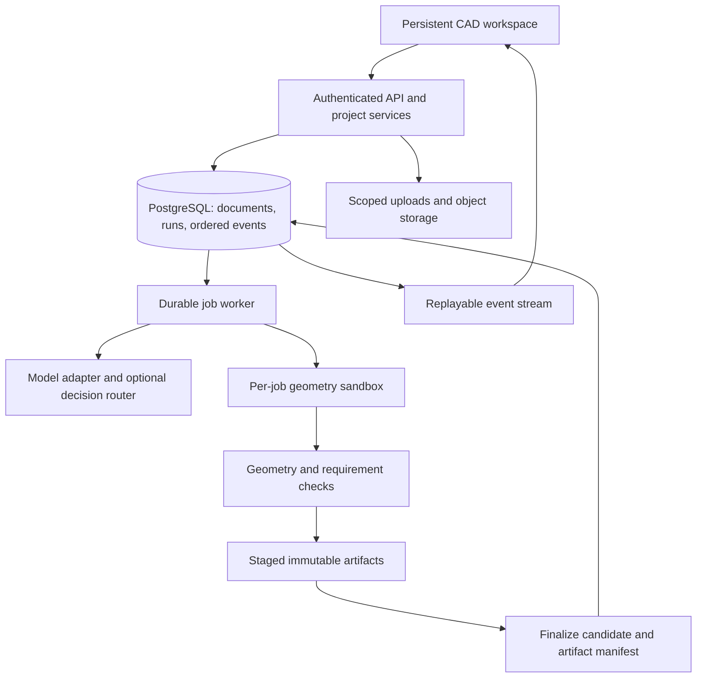

# CadPilot combined platform and website audit

24 September 2026

This document brings together the complete platform target-state assessment and website UX audit. It preserves both audits’ findings, source references, screenshots, recommendations, roadmaps, and verification limits. The original audit files remain available unchanged.

The shared recommendation is a coherent, model-centered CAD product: dependable design state and execution, consistent page journeys, reviewable AI edits, and evidence-backed exports. Findings describe the inspected working tree; proposed capabilities and performance targets are not claims of completed implementation.

## Contents

- [Part 1: Platform, product UX, and backend](#part-1-platform-product-ux-and-backend)
- [Part 2: Website and page-by-page UX](#part-2-website-and-page-by-page-ux)
- [Combined implementation sequence](#combined-implementation-sequence)
- [Part 3: Ideal AI-product UI and Vercel-inspired generation experience](#part-3-ideal-ai-product-ui-and-vercel-inspired-generation-experience)

## Implementation progress — 24 September 2026

25 September validation repair: deterministic invalid-geometry results now enter the worker's bounded provider repair loop, just like kernel exceptions, rather than failing only after the repair loop has exited. The pre-staging validity guard remains. Eight worker simulation tests pass, including invalid geometry producing no output without a provider and a repaired second attempt succeeding with a simulated provider. This verifies orchestration, not real provider repair quality.

25 September worker-side parent check: queued edits recheck that their parent belongs to the job's project and remains ready before reading its source. An unavailable parent fails the job explicitly instead of treating it as a new design. Six worker simulation tests pass; the added regression asserts the query's project/readiness scope and that unavailable parents produce no revision or artifact writes. Live concurrent parent-state changes remain untested.

25 September edit continuity guard: when the generation provider is unconfigured, jobs with an existing parent now fail explicitly before creating a revision or writing artifacts. Previously they could return a built-in gear/stand template as though it were an edit. Five simulated worker tests pass, including preservation of the existing base with zero output writes. New-design template fallback remains available; faithful editing of manual imports and provider-backed geometry continuity are still unresolved.

25 September worker notification resilience: synchronous socket-creation failures now resolve as `workerConnected: false` instead of rejecting after the queue transaction has committed. A socket closing before connection also settles the notification rather than leaving it pending. Five simulated socket tests and four build-route tests cover transport outcomes and preservation of the accepted job when the worker is unavailable. Connection success is not a worker execution acknowledgement; live queue recovery remains to be verified.

25 September manual-import checks: reject empty/incomplete triangle meshes and non-positive surface area before creating revisions, alongside existing finite-measurement/positive-volume checks. Imported kernel shapes are released in a finally block on success, validation rejection, and storage failure. Eight simulated import-route tests pass, including small positive volume preservation and five invalid geometry cases with no revision/artifact writes. These checks do not establish watertightness or engineering correctness.

25 September measurement precision: generated builds and manual imports retain measured volume/area rather than rounding to integers before validation. This prevents small positive-volume parts from being rejected as zero-volume. Runtime validity also rejects non-finite volume/area; manual imports reject non-finite measurements. Three real-kernel tests now pass, including STEP round-trip of a 0.1 mm cube (0.001 mm³); three simulated export tests and two import-finalization tests also pass. This verifies the small-part runtime case, not all import geometries or manufacturing suitability.

25 September real-kernel verification: `node scripts/test-real-export-completeness.mjs` passes two tests using installed Replicad/OpenCascade, without kernel mocks. A 10 mm cube exports and re-imports as 1,000 mm³ with complete status. A cube plus a tetrahedral raw mesh reports 1,167 mm³ in combined metrics, but its re-imported STEP contains only 1,000 mm³; the runtime correctly flags that export as incomplete. These fixtures verify the specific raw-mesh omission gate, not arbitrary generated-model validity or the live database/worker workflow.

25 September export integrity follow-up: raw mesh parts omitted from STEP now produce a validation warning and `complete: false`, including mixed solid/mesh assemblies that still produce a partial STEP file. Preview and STL remain available for private inspection. Three new build-runtime tests cover mesh-only, mixed, and solid-only output using a simulated Replicad kernel and real runtime/mesh processing (`node scripts/test-export-completeness.mjs`); this is not an OpenCascade geometry certification. Existing saved validations are not retroactively rewritten.

25 September workspace alignment: Publish eligibility now matches the strict API check (`complete === true` plus an explicit empty warnings array), and the click handler also guards eligibility. The Review panel explains why publishing is unavailable and how to recover while retaining private review. Missing evidence no longer displays “Build checks passed.” TypeScript and diff checks pass; this update has not received live browser verification. The UI/UX skill informed the explicit unavailable-state explanation using the existing inline-note pattern.

25 September publication evidence follow-up: the publish API now requires literal `validation.complete: true` and an explicit empty warnings array. Previously missing completeness or malformed warnings could pass the gate. Legacy revisions without this evidence must be rebuilt or re-imported before a new publication; existing publication pointers are not changed by this patch. Fifteen simulated publishing/download route tests pass, including five new missing/malformed-evidence cases. This is an export-completeness gate, not proof of engineering correctness or live storage integrity. Workspace eligibility messaging still needs to match this stricter legacy-record policy.

25 September execution-queue follow-up: execute-mode requests to the project runs endpoint (including omitted mode, its existing default) now delegate to the build endpoint instead of creating a queued run without a worker job. The prompt and parent revision reach the same owner-checked, transactional build queue used by the workspace. Four plan/run routing tests and three build-route tests pass with simulated dependencies; these cover input preservation, rollback, parent validation, and worker notification after commit, not a live worker execution.

25 September plan reliability follow-up: run creation (including its nested step and approval) and the initial event now commit in one transaction. The two plan-route tests pass, including simulated rollback when the initial event write fails. This closes a partial-write path that could return an error while leaving an approval pending; live PostgreSQL verification remains outstanding.

25 September follow-up: corrected public artifact responses that previously allowed five minutes of shared caching despite revocable publication. Downloads now use `private, no-store` and dynamic authorization checks, including error responses. Seven publishing route tests pass, including a successful download followed by revocation and a denied request with no further storage read. This verifies route behavior with simulated database/storage dependencies; it cannot retract already downloaded files or purge responses cached under the old policy.

The findings below record the original inspection. Implementation is proceeding in milestones; this log distinguishes source changes from verified product behavior.

- Removed the composer controls that only stored a filename/local model selection, and the inactive add-view button. Review icons now reflect step status.
- Private-link copying explicitly preserves owner-only access. Public sharing targets the published project; it does not claim to share the latest private revision or grant access.
- Build, approval, and cancel requests now handle network/response failures and release their request locks. Failed submissions retain the prompt. Pending approvals are restored from stored runs after reload.
- Plan requests retain and validate the parent revision; approval queues the job against that parent and wakes the worker.
- Run event streaming reads Last-Event-ID, polls sequentially, and releases timers on completion, request abort, and stream cancellation. Three focused tests exercise terminal delivery, reconnect/cancellation, and abort during a database request: `node scripts/test-run-event-stream.mjs`.
- Revision history is now an explicit workspace control. Completed revisions can be selected as the next editing base without overwriting history; the review panel shows the selected revision, timestamps, prompt context, parent lineage, and a lightweight metric comparison to the newest completed revision.
- Public sharing now resolves to the project’s explicitly published, validated revision and exposes only that revision’s artifact files through a scoped unauthenticated download route. The public page shows revision identity, validation state, metrics, and available exports; it does not expose private workspace artifacts.
- Public project pages now include a read-only orbit/zoom preview backed by the published preview mesh. The preview has no save, import, or edit path, and falls back to a clear unavailable state when the mesh is missing.
- The workspace now exposes the existing publish API as a real action: a completed selected revision can be published, project visibility/published revision state updates locally, and the UI reports the published revision. Incomplete revisions never receive the publish action.
- The selected revision is now reflected in the workspace URL as `?revision=<id>`, so history selection survives reloads and can be deep-linked within the owner workspace. Invalid or incomplete revision IDs fall back to the newest completed revision.
- `node scripts/test-publishing.mjs` covers six sharing invariants: incomplete revisions cannot publish, completed revisions pin the public revision, warning-bearing revisions cannot publish, unpublishing revokes visibility and clears the public revision, unpublished artifacts are not read, and only published validated artifacts are served.
- Public sharing is now revocable from the workspace with “Make private”; the public route stops resolving after the owner revokes publication, while the completed revision remains available for later republishing.
- Removed the disabled Export STEP/STL buttons from the landing-page CAD demo. The demo now labels exports as a Studio capability instead of presenting controls that cannot act.
- Manual ChiliCAD revisions now surface an explicit “manual base” warning in the workspace. The worker detects their non-executable source marker and does not pass it to Gemini as Replicad code; the next AI request starts a fresh editable source while retaining the manual revision as lineage. True STEP-to-parametric reconstruction remains future work.
- The embedded renderer now selects its preview mesh by the workspace’s selected revision ID instead of always using the newest revision, preventing mixed revision state when reviewing history.
- Plan-mode runs now derive a prompt-based intent and parametric plan before approval, including explicit dimensions when supplied, opening/fit/assembly constraints, material hints, and feature operations. The same plan is stored in run metadata, shown in the approval explanation, and used by the worker event stream. `node scripts/test-intent-plan.mjs` covers extraction and approval-plan content.
- The actual plan route is covered by `node scripts/test-plan-request.mjs`: it verifies a plan run stores concrete intent/plan metadata, remains in `AWAITING_APPROVAL`, and exposes the concrete dimensions in the approval explanation.
- Geometry validation now distinguishes usable geometry from complete exports. Worker-built revisions include `validation.complete` and structured `validation.warnings`; skipped parts or export failures are surfaced in the owner workspace and public project page instead of being presented as an unqualified clean validation.
- Publishing now requires a complete validation state. The workspace hides Publish for revisions with unresolved warnings, and the publish API rejects them server-side; `node scripts/test-publishing.mjs` covers this rejection alongside public-artifact isolation.
- The Review panel now lists staged/incomplete revisions with their revision number, prompt, artifact count, and findings while keeping them unavailable as editing or publishing bases.
- Revision-history controls now expose `aria-pressed`, descriptive labels, and visible keyboard focus, so the active editing base is not communicated by color alone.

Verification: production build and diff checks passed. The three event-stream tests passed. A browser-agent subagent using gpt-5.6-luna opened the production project list and workspace with an existing authenticated session; no runtime errors were reported. This was read-only verification, not a completed generation/approval/cancellation test. An earlier concurrent dev/build check failed from shared build-output interference; sequential production verification resolved that failure.

Worker milestone: added cancellation checkpoints before build attempts and artifact writes. Worker event, startup, failure, and success transitions now use a conditional job-row transaction shared with the cancellation endpoint. A cancellation that wins that row prevents later worker success/failure writes; completion that wins makes a late cancellation return a conflict. This is cooperative cancellation: it does not interrupt an already-running OpenCascade operation or provider request. Revisions begin with `isValid: false`; artifact metadata, revision readiness, the assistant result, and successful job/run state are finalized in one database transaction after artifact writes. Failed or cancelled staging revisions remain unvalidated for diagnosis. Four deterministic lifecycle tests cover terminal-state rejection, rollback, and the two cancellation/completion orderings (`node scripts/test-job-lifecycle.mjs`); they model transaction locking and do not replace PostgreSQL concurrency verification.

Worker verification: production build passed. `node scripts/test-worker-pipeline.mjs` additionally runs the actual worker function with simulated storage, CAD, and database dependencies. Four cases pass: all 15 artifacts saved before success, cancellation during geometry, cancellation during artifact writing, and artifact write failure. Together with the lifecycle suite this is eight focused passing checks, not a real geometry or live database stress test. Staged revisions are linked to their originating job for diagnosis.

Still open: live PostgreSQL concurrency and end-to-end generation/approval/cancellation verification, immediate process/provider cancellation, staging-revision presentation and cleanup, actual plan generation, immutable public preview links, geometry validation, the broader page redesign, and the remaining roadmap. Revision selection and basic comparison are now implemented, but deeper geometric diffing and restore-as-a-new-branch are not. Public sharing is scoped to the selected published revision, while immutable revision-specific URLs remain open. A production build or CSS contract test alone does not verify these behaviors.

## Part 1: Platform, product UX, and backend

Implementation follow-up: the workspace uses the newest completed revision as the editing base and counts unfinished revisions separately. Build, plan, and approval endpoints reject an unfinished parent. Build creation now commits the job, run, user message, and initial events together before notifying the worker, closing the initial-event allocation race. `node scripts/test-build-request.mjs` passes three tests against the actual route with simulated dependencies: unfinished-parent rejection, notification after commit, and rollback on initial-event failure. Production build passes; these checks do not establish live database race coverage.

Research date: 24 September 2026. This is a proposed product direction and implementation roadmap, not a claim that the features below already exist.

### Product decision

CadPilot should help a designer turn an engineering requirement into an editable part, make successive changes without losing intent, and hand off a revision with explicit evidence about what was checked.

The initial audience should be individual hardware designers and small teams building brackets, enclosures, fixtures, adapters, and simple assemblies. This is an assumption to validate with users. It provides a tractable scope for geometry, editability, and manufacturing checks. Industrial surfacing, large assemblies, simulation, and full CAM would substantially expand the product and should follow demonstrated demand.

The differentiator should be the complete iteration loop: describe → inspect → select → edit → compare → export. Measure success by accepted, reusable designs and successful follow-up edits. A plausible first render is insufficient.

### Evidence and limits

This review inspected the current working tree, including uncommitted work; source takes precedence over older checklists. The repository already contains useful foundations: Next.js/React, PostgreSQL/Prisma, project ownership checks, revision lineage, a separate CAD worker, stored run events, artifact endpoints, and an embedded Chili3D editor using Replicad/OpenCascade outputs. Existing changes are preserved.

The UI/UX skill informed interaction, accessibility, and visual restraint. Its generic design-system search suggested a marketing layout that does not fit a CAD workspace; that layout was rejected. The workspace proposal below is a product-specific recommendation. No customer interviews, production telemetry, CAD accuracy benchmark, load test, or complete security audit was available. Proposed performance targets are acceptance goals, not measured results. Browser observations are recorded separately below when available.

#### Current gaps verified in source

| Finding | Evidence | Consequence and priority |
|---|---|---|
| AI editing loses the executable representation after a manual edit | [Manual import](/home/manan/CadPilot/app/api/projects/[slug]/chili-import/route.ts) stores a comment as `sourceCode`; the [worker](/home/manan/CadPilot/scripts/cad-agent-worker.mjs:132) supplies only parent source to generation | The next AI edit lacks the saved geometry as an executable base. Fix before promising seamless mixed editing. P0. |
| Geometric success is overclaimed | [Build runtime](/home/manan/CadPilot/lib/cad/build-runtime.mjs:242) marks positive rounded volume and nonzero triangles valid; failed operations/parts can be skipped | A missing shell, missing part, or missing STEP can coexist with a valid revision. Separate build success, geometric validity, requirements, and export completeness. P0. |
| Cancellation is not enforced by execution | [Cancel endpoint](/home/manan/CadPilot/app/api/runs/[runId]/cancel/route.ts) changes records; [worker](/home/manan/CadPilot/scripts/cad-agent-worker.mjs:191) has no cancellation checkpoints and writes success unconditionally | A cancelled run can continue and overwrite terminal state. P0. |
| Some visible controls are incomplete | [Composer](/home/manan/CadPilot/components/projects/agent-composer.tsx) stores an attachment filename and local model selection but passes neither into submission; [workspace](/home/manan/CadPilot/components/projects/project-workspace.tsx:133) has Share and add-view buttons without handlers | Users cannot distinguish working features from placeholders. Implement or remove unsupported affordances. P0. |
| Stored history is only partially an editing control | [Workspace](/home/manan/CadPilot/components/projects/project-workspace.tsx) now allows completed revision selection and basic metric/lineage comparison; deeper geometric diffing and branch restore remain | Add artifact-aware diffing and restore-as-a-new-revision once revision semantics are defined. P1. |
| Planning lacks an engineering specification | [Worker](/home/manan/CadPilot/scripts/cad-agent-worker.mjs:63) uses empty dimensions and a fixed material; [plan route](/home/manan/CadPilot/app/api/projects/[slug]/runs/route.ts) creates a generic approval | The displayed plan does not establish what will actually be built. P0. |
| Plan-mode edits do not retain the base revision | [Approval route](/home/manan/CadPilot/app/api/agent-runs/[runId]/approval/route.ts:28) creates a job without `parentId`; pending approval in the workspace starts as local `null` | Edits may become fresh generations; a reload can hide the decision controls. P0. |
| “Blueprint” outputs are envelope illustrations | [Worker drawing functions](/home/manan/CadPilot/scripts/cad-agent-worker.mjs:85) draw bounding rectangles and labels | These are not projected engineering drawings. Relabel now, implement real projections later. P0 label correction; P2 drawing service. |
| Print readiness is inferred from incomplete evidence | [Preflight](/home/manan/CadPilot/app/api/projects/[slug]/revisions/[revisionId]/print-preflight/route.ts) infers watertightness from validity/volume and checks artifact presence | File availability does not prove printability. P0 label correction; P1 topology checks. |
| Event and revision allocation are inconsistent | [Worker](/home/manan/CadPilot/scripts/cad-agent-worker.mjs:43) uses count-plus-one for build events and revisions; some agent-event writers use serializable retries, others do not | Concurrent producers can collide. Allocate sequences and revisions atomically using shared logic. P0. |
| Streaming cleanup and resume are incomplete | [SSE route](/home/manan/CadPilot/app/api/runs/[runId]/events/route.ts) has an empty `cancel()`, interval polling, and an `after` query cursor without reading `Last-Event-ID` | Disconnects can leave polling active; reconnects replay unnecessarily; async polls can overlap. P0. |
| Revision publication can precede artifact completeness | Worker and manual import create valid revisions before sequential artifact writes | Failures may leave incomplete revisions visible or publishable. Stage and finalize atomically at the metadata boundary. P0. |
| Account recovery is unfinished | [Password reset](/home/manan/CadPilot/app/api/auth/password-reset/request/route.ts) logs codes instead of delivering email | Recovery cannot be treated as production-ready. P0 before external beta. |

These are source findings, not claims that every failure has been reproduced at runtime. Older checklist statements about completed cancellation, command parity, or preflight are not sufficient evidence of end-to-end behavior.

#### Browser and screenshot evidence

Browser-agent work was delegated to a `gpt-5.6-luna` subagent following the user's instruction to use the cheapest available model for browser work. Initial requests returned `ERR_CONNECTION_REFUSED`; the subagent subsequently started the existing app, inspected `/`, `/projects`, and `/chili-editor`, and stopped its development server afterward. Startup succeeded without a reported compile blocker. No accounts, projects, builds, or source files were changed during the browser review.

Live desktop evidence:

- [Landing page](/home/manan/browser-agent/artifacts/screenshots/shot-20260924T184502-329.png): the headline and project CTA have clear hierarchy, but visible branding says “Agentic CAD” while the editor says “CadPilot.” Standardize the product name. The first screen emphasizes technical engine terminology; prioritize the user's editable-part outcome and show a complete example earlier.
- [Editor with tool search open](/home/manan/browser-agent/artifacts/screenshots/shot-20260924T184639-607.png): search opens successfully with visible focus, and the compact toolbar leaves substantial canvas space. The empty canvas lacks a central next-step prompt. Search exposes “Performance Test” and the vague “Toggle”; filter diagnostic commands from ordinary workflows and give ambiguous commands meaningful names. These are observed presentation issues; full command execution was not verified.

Existing screenshots additionally provide earlier responsive evidence:

- [Desktop workbench, 1280×720](/home/manan/CadPilot/output/playwright/unified-workbench-desktop.png): clear menus and toolbar, a largely empty canvas with weak first-use guidance, and substantial space occupied by Items/Properties.
- [Mobile workbench, 390×844](/home/manan/CadPilot/output/playwright/unified-workbench-mobile.png): toolbar wrapping reduces canvas height and the bottom constraint row appears clipped. Discoverability of object/property inspection needs live usability testing.

These observations support a focused empty state, more economical mobile controls, and explicit access to the inspector. The mobile observations were not reverified live. Authenticated project behavior and complete edit/save/export flows still require verification; screenshot appearance alone does not prove a control is functional or disabled.

### Lessons from comparable products

| Reference | Verified pattern | CadPilot recommendation |
|---|---|---|
| [Shapr3D adaptive UI](https://support.shapr3d.com/hc/en-us/articles/7873882619548-Adaptive-user-interface) | Selection changes the available modeling tools | Make selected geometry the shared context for tools, properties, and AI instructions. |
| [Onshape document management](https://cad.onshape.com/help/Content/Document/document_management.htm) and [comparison](https://cad.onshape.com/help/Content/Document/compare.htm) | Persistent history, immutable versions, recoverable workspaces, graphical comparisons | Preserve drafts automatically and make each accepted design recoverable and comparable. |
| [Fusion parameters](https://help.autodesk.com/view/fusion360/ENU/?contextId=SLD-MODIFY-PARAMETERS) | Named user and model parameters expose design control | Surface dimensions and expressions directly so simple edits do not require a chat round trip. |
| [Zoo Zookeeper](https://zoo.dev/research/zookeeper) | Conversational modeling works alongside graphical/code editing and selection context | Treat continuity of design intent across edits as a core architecture requirement. |

These are documented product patterns, not comparative usability or accuracy test results. CadPilot should validate its own version of them with its intended users.

### Ideal user journey

1. **Start with context.** Create from a requirement, a known parametric template, or imported geometry. Keep project naming optional until useful work exists. Offer examples with dimensions and intended use. Label STEP as imported geometry and STL as mesh; neither implies a recovered original feature tree.
2. **Establish the specification.** Display dimensions, units, material if known, manufacturing process if known, and assumptions. Ask only for missing facts that would materially change the design. Never silently invent a material or tolerance.
3. **Build a candidate.** Leave the accepted model visible while work runs. Show actual stages and elapsed time. A preview can appear early, but it must be labeled as a preview until precise geometry and checks finish.
4. **Review the result.** Show the new model with a short change summary and pass/fail/not-checked requirements. Selecting a finding highlights the affected geometry when a reliable reference exists.
5. **Edit naturally.** Select a face, hole, edge, part, or parameter; type “make this 2 mm thicker” or change a numeric value. A visible selection chip states exactly what the request targets. Unresolved references trigger clarification.
6. **Accept or restore.** Compare candidate and base using the same camera. Show dimension changes and added/removed bodies as well as a visual overlay. Accept a candidate explicitly or use an opt-in auto-accept policy for bounded, reversible parameter edits. New drafts preserve the previous accepted version.
7. **Prepare the handoff.** Export a pinned revision with units, scope, tessellation settings, and relevant check results. Share a specific revision with scoped access. Keep manufacturing preparation separate from basic file export.

Example acceptance journey: generate an enclosure with a 2 mm wall; manually add a mounting hole; ask AI to move that hole 5 mm; verify the wall and all unrelated geometry remain unchanged; export STEP; reimport and confirm the expected dimensions within the declared tolerance; restore the earlier revision.

### Workspace and visual design

Use one persistent workspace with the model occupying most of the screen. At a 1440 px desktop width, start with a 240 px model tree, an approximately 840 px canvas, and a 360 px contextual panel. These are prototype starting values. Allow resizing, collapse, and persistence per user. Avoid a permanent 50/50 conversation/canvas split once modeling starts.

```text
Project / revision · Draft saved                       Compare  Export  Share
----------------------------------------------------------------------------
Model tree           Modeling canvas                  Context panel
Parts / Features     Contextual tools                 Properties | Assistant
Parameters           Selection + dimensions           Selected: Hole 4
                     Orientation + section view       Diameter: 6 mm
                     Candidate/base overlay           Request + change card
----------------------------------------------------------------------------
History / versions                 mm · Save state · Geometry/check status
```

The left tree answers “what is this model made of?”; the right panel answers “what can I do with the selection?” Switch its contents rather than stacking multiple competing inspectors. During AI work, a compact persistent activity strip remains visible when Properties is open. Detailed execution logs live behind Activity. All panels refer to the same document, active revision, and selection.

**Visual direction.** Extend the existing quiet workbench tokens: neutral light surfaces, subtle dividers, blue for selection/actions, and restrained semantic colors. Offer a tested dark theme later without changing geometry color semantics. Use the existing system font, tabular numerals for measurements, 13–14 px compact desktop labels, and 15–16 px reading/input text. Use a 4 px spacing scale and modest corner radii. Heavy shadows, decorative gradients, and ornamental animation compete with geometry.

**Navigation.** Keep Projects, Model, History, and Export predictable. Provide command search with synonyms, shortcuts, and disabled-state explanations. Commands should reflect actual selection types, not only selection count. Label common actions in plain CAD terminology. “Open renderer” is an implementation detail; use “Fit model” or “Open model” only when those actions match the behavior.

**Selection.** Distinguish hover, selected, hidden, locked, and candidate geometry. Support selection filters and selection through the tree. Cross-highlight between the tree, viewport, measurements, change summary, and assistant. Preserve selection and camera when opening a report or changing panels. Make multi-selection explicit and provide “Clear selection.”

**Parameters.** Named fields need units, numeric bounds, expression support where implemented, and local validation. Show pending preview versus committed values. A failed change retains the last accepted geometry and places the error beside the relevant parameter. Maintain the difference between undoing a local action and restoring a saved revision.

**Assistant.** Use compact change cards: request, affected entities, assumptions, changed dimensions, validation evidence, and accept/discard. Detailed reports remain expandable. Show actual execution stages instead of presenting sequential helper functions as autonomous subagents. Expose model selection only if it changes real execution and users benefit from choosing it. A stop button must actually stop the run; attachments must upload and become explicit context.

**Projects and onboarding.** Show model thumbnails, last successful revision, save/run status, and recent activity. Add search and archive as the list grows. Let users resume a design in one action. The landing page should show a real editable example and the prompt-to-edit-to-export loop. Clearly distinguish illustrative renders from measured CAD outputs.

#### State contracts that make the UX dependable

Track these independently: engine loading, mesh preview available, precise model loaded, local dirty state, draft saving, draft saved, build running, candidate ready, checks incomplete, save failure, and connection interrupted. A single `ready` flag cannot represent them.

Every asynchronous import/export carries a request ID and revision ID. Ignore stale results. A new AI result must not overwrite unsaved manual work: offer it as a candidate based on its original revision. Preserve a local recovery snapshot and reconcile it explicitly with server state on reload. Save errors leave a persistent recovery action, not only a disappearing toast.

#### Responsive behavior and accessibility

Desktop prioritizes modeling. Tablet uses one dismissible side panel and touch-friendly selection. Phone prioritizes viewing, measurement, comments, approval, and export; full precision modeling should wait for a demonstrated usable interaction design. Do not simply stack a desktop transcript above an offscreen editor.

Provide keyboard navigation, visible focus, properly associated labels, command cancellation via Escape, and numeric alternatives to dragging. Panel resizing needs keyboard controls and click/tap size presets. The latter also supplies a non-drag pointer alternative. Test focus transitions across the engine iframe and never intercept text-editing shortcuts as CAD commands.

Use a WCAG 2.2 AA target: normal-text contrast of 4.5:1, non-color status indicators, and appropriately sized controls. The AA minimum target-size criterion is 24×24 CSS px with exceptions; 44×44 is a useful touch design goal, not the blanket AA minimum. See [W3C target size](https://www.w3.org/WAI/WCAG22/Understanding/target-size-minimum.html) and [dragging alternatives](https://www.w3.org/WAI/WCAG22/Understanding/dragging-movements.html). Provide a semantic tree, accessible measurements, and text descriptions of results alongside the graphical viewport. Validate actual operability rather than assuming ARIA makes all 3D interactions accessible.

### The core backend decision: one coherent design representation

The hardest problem is keeping graphical edits, AI edits, source, and geometry consistent. A STEP round trip preserves geometry but does not automatically preserve editable construction history. A generated JavaScript file is also not automatically a structured parametric model.

Adopt a versioned design document containing named parameters with units, feature/operation dependencies, stable part IDs, entity references, constraints, and provenance. Compile supported operations to the existing Replicad/OpenCascade runtime. Store evaluated geometry and artifacts against the document version. Both graphical commands and AI proposals should submit changes against this shared representation.

Deliver this incrementally:

1. Define source-backed, imported-BREP, and mesh-only revision capabilities. Store native editor snapshots if the pinned engine can reliably serialize and restore them. Verify that capability before promising it.
2. For imported geometry, preserve an immutable geometry asset as a base and apply supported operations to it. Do not pretend the original feature tree was recovered.
3. Introduce typed operations for the small core: parameters, sketches, extrude, revolve, boolean, transform, fillet/chamfer, shell, and patterns. Preserve raw source as a legacy/advanced representation with explicit capabilities.
4. Route more graphical commands through the shared document only after bidirectional round-trip tests pass. Keep unsupported engine edits as explicit imported-body checkpoints rather than fabricating source.

Persistent face/edge references require dedicated engineering. Raw face indices can change after booleans or regeneration. Use feature-owned references and kernel history where available, plus explicit remapping/ambiguity detection. Stop the edit when a reference cannot be resolved reliably; never choose a vaguely similar face silently.

#### Suggested domain model

| Entity | Responsibility |
|---|---|
| Workspace / Membership | Team boundary and owner/editor/reviewer/viewer permissions |
| Project / DesignDocument | Current draft head, schema version, units, document metadata |
| Revision | Immutable document snapshot, parent, author, origin, accepted/candidate status |
| GeometryAsset | Imported/evaluated BREP or mesh, checksum, format and capability metadata |
| Parameter / Feature / Constraint | Structured intent, dependencies, units, stable identifiers |
| Run / Attempt / Step / Event | Execution lifecycle, retries, ordered events, leases, cancellation |
| ChangeProposal | Base revision, proposed changes, evidence, accept/discard state |
| ValidationCheck | Check ID/version, pass/fail/unknown/not-applicable, measured/expected values |
| Artifact / ExportJob | Revision-derived files, checksums, ready state, format settings |
| ReviewComment / ShareGrant | Revision or entity anchors, expiry/revocation, access scope |
| UsageLedger | Model/kernel/storage usage and attributed costs |

These are logical responsibilities; do not create all tables immediately. Extend the existing project/revision/run schema first. Parameter and feature data may initially live in a schema-validated document. Explicit schemas and migrations matter more than prematurely normalizing every field.

### Execution architecture

Keep the current stack and a modular application. Separate long-running execution and trust boundaries without immediately introducing a large microservice estate.



**Job lifecycle.** Specify guarded transitions: queued → planning → executing → validating → candidate-ready, with explicit waiting-for-input, failed, and cancelled states. Separate computation completion from the user accepting a design. Bind plans and approvals to a base revision and plan hash. Persist enough state to resume after reload or worker restart.

**Leases and retries.** Each claim needs an attempt ID, lease expiry, heartbeat, and fencing token. Reclaim expired work safely. Retry transient provider failures with bounded backoff, and repair geometry under an independent attempt/cost budget. Assume at-least-once delivery; make effects idempotent. A duplicate request must not produce duplicate accepted revisions or usage charges inside the application ledger.

**Cancellation.** Mark a cancellation request, abort provider calls where supported, and terminate the per-job geometry process when necessary. Check cancellation/fencing before committing any result. Late responses may be recorded for diagnostics but cannot change a cancelled run to successful. Display “Stopping” until the worker acknowledges.

**Events.** Use one append operation for monotonically ordered run events across worker, approvals, cancellation, and retries. Keep sequence ordering in the client rather than relying on timestamps. Support `Last-Event-ID`, heartbeat comments, bounded replay, pagination, snapshot reconciliation, and abort cleanup. SSE remains adequate for run progress; use WebSockets later if live presence/editing requires bidirectional traffic.

**Artifact completion.** Write files to attempt-scoped staging keys, verify checksums and a required-artifact manifest, then commit ready metadata and the revision reference in a database transaction. Object storage and the database are not one atomic transaction: retain cleanup/reconciliation jobs for orphaned staging data and incomplete commits. Use immutable object keys and explicit export versions.

**Isolation.** Move geometry execution and untrusted STEP/mesh parsing out of request handlers into bounded jobs. The model orchestration process can reach providers; geometry execution gets no model/DB secrets or network egress. Enforce CPU, memory, filesystem, and wall-clock limits outside JavaScript. Node explicitly says [`node:vm` is not a security mechanism](https://nodejs.org/api/vm.html); keyword restrictions are only additional checks.

**Storage and access.** Introduce an object-storage adapter, scoped upload limits, MIME/format validation, authorization on every artifact, and short-lived download grants. Pin shared links to revisions, make access revocable, and distinguish private sharing from public publication. Add backup/restore drills, retention policies, account deletion handling, real recovery email, rate limits, and cookie-auth mutation protections before broader release.

**Observability and cost.** Correlate request, run, attempt, revision, model, and artifact IDs. Record queue delay, provider latency, geometry time, repair rate, cancellations, import/export failures, peak memory, and cost per accepted design. Record model and kernel versions for reproducibility. Add per-user concurrency and spend limits, bounded output sizes, and an operator view for failed/stuck work. Do not log raw secrets or recovery codes.

**Framework choices.** Preserve Next.js, React, Prisma, PostgreSQL, and the existing CAD stack unless measured constraints justify changes. A reliable PostgreSQL-backed worker can serve the first stage. Re-evaluate a durable workflow engine when resumable multi-step execution and operational complexity exceed the current worker's maintainability. Pin supported runtime/dependency versions and test upgrades; adding a new orchestration framework alone does not establish correct cancellation or idempotency.

### Validation and manufacturing features

Replace a single quality score with independent evidence:

| Layer | Required evidence | User-facing result |
|---|---|---|
| Execution | Supported operations completed; required features/parts present | Built / partially built / failed |
| Geometry | Kernel shape validity, solid/shell classification, finite measurements, relevant topology checks | Geometry checks passed / failed / not checked |
| Requirements | Requested dimensions, counts, relationships, clearances and tolerances compared to actual geometry | Each requirement independently passed/failed/unknown |
| Export | Required bodies represented; reimport succeeds; dimensions and units preserved within declared tolerance | STEP/STL/3MF check results by format |
| Manufacturing | Process-specific checks with a selected machine/material/profile | Preflight findings, assumptions, and unchecked properties |

Use kernel validity analysis where supported by the deployed binding, with a native worker adapter if necessary. [OpenCascade's documented validity framework](https://dev.opencascade.org/doc/occt-7.3.0/refman/html/annotated.html) illustrates the distinction between a measurable shape and a checked shape; this reference is conceptual, not verification that every API exists in the current WASM build.

Treat failure of a requested shell or hole as a failed requirement, even if a solid remains. A skipped decorative fillet may be a visible warning only under an explicit policy. Do not force every assembly part to touch: legitimate clearances and exploded views exist. Validate against assembly intent.

Keep precise measurements unrounded internally. Identify mesh-derived approximations separately from BREP measurements. Avoid summing overlapping body volumes as if that necessarily describes the physical assembly's occupied volume.

For FDM, add actual mesh manifold/watertight checks, degenerate faces, connected components, dimensions/build-volume checks, scale, and orientation. Later add wall/clearance and overhang analysis with printer/material assumptions. STL must remain exportable when 3MF is absent. A 3MF container is not a printer-specific sliced job; do not claim print-ready G-code without a slicer and machine profile.

Real drawings need orthographic projections, section/hidden-line support, associative dimensions, and revision-linked annotations. Start with reliable projected views and basic dimensions; label unsupported drawing capabilities. CNC checks, sheet metal, joints, motion, BOMs, and simulation belong to subsequent scoped tracks with explicit validation criteria.

### Where Jev and Laya belong

A correction to the earlier discussion: `jevmodel.org` is an independent site. The official TypeSafe quickstart specifies `https://api.typesafe.ai/v1/systemone` and keys from its own console. Use [TypeSafe's official integration documentation](https://docs.typesafe.ai/introduction/quickstart).

Jev's typed decisions are useful for routing an instruction, detecting ambiguous references, choosing a relevant reference document, and classifying recoverable failures. Ask narrow questions and combine answers in application logic, as described in the [official introduction](https://docs.typesafe.ai/introduction). These are proposed CadPilot uses, not measured performance here.

Keep exact dimensions, permissions, cancellation, geometry validity, and export completeness deterministic. A decision model should not certify a CAD result or approve manufacturing. Choose tools directly from deterministic selection rules when those suffice.

Laya is an independent open-source decision model with English, multilingual, and typed-decision checkpoints. Its [upstream repository](https://github.com/NandhaKishorM/laya) documents short context limits, checkpoint-dependent behavior, and current weaknesses including label sensitivity and scoring bias. Evaluate it as a model to specialize on a stable task. Published local inference times are not end-to-end CadPilot latency measurements.

Start without making either provider mandatory. Collect a labeled routing dataset; compare deterministic rules, the existing model, Jev, and Laya on a held-out set. Measure per-class errors, abstention/coverage, calibration, total latency, operational cost, and downstream edit failures. Use shadow decisions first, then permit low-impact routing where evidence supports it. Revert routing on outages or regressions.

Do not copy a universal 0.85 threshold. Jev's `confidence` is derived from its distribution; it is not automatically an empirical probability of correctness on CAD requests. `noul` represents the proposition's probability and has no separate confidence field. See [TypeSafe confidence documentation](https://docs.typesafe.ai/confidence). Keep ambiguous decisions on a fallback path and tune thresholds by action and error cost.

### Delivery order and acceptance gates

| Stage | Scope | Exit evidence |
|---|---|---|
| P0 — truthful, recoverable core | Fix cancellation, incomplete controls, parent lineage in plan mode, pending-plan reload, event cleanup/order, numbering races, artifact finalization, accurate validation/drawing labels; isolate geometry execution before external untrusted use | Cancellation cannot later publish; refresh restores pending work; duplicate requests and concurrent saves do not corrupt revisions; partial exports never appear complete |
| P1 — dependable daily modeling | Persistent canvas layout, shared selection, named parameters, draft recovery, candidate compare/accept, source/import capability contract, initial typed operations, basic topology and requirement checks | The enclosure/manual-hole/AI-move/export/restore journey passes repeatedly with exact requirements and no unrelated changes |
| P2 — useful handoffs and teams | Robust uploads, object storage, scoped sharing, reviewer comments, revision comparison, credible print preparation, genuine drawings, team roles and usage visibility | A second user can review a pinned revision; access revocation works; exports reimport correctly; manufacturing findings show evidence and limits |
| P3 — evidence-driven expansion | Better assemblies, constraints/joints, configuration families, BOMs, drawing depth, specialized model routing, optional fine-tuning, integrations | User research and benchmark results justify each feature; adoption and task success improve without sacrificing reliability |

Stage order is dependency-based; calendar estimates require team capacity and an engine capability spike. Keep geometrical editing and representation work as an explicit technical track rather than burying it in UI polish.

#### Proposed acceptance budgets

For a declared reference laptop, browser, network profile, and model corpus: local interaction feedback within 100 ms; cached project preview usable within 2 seconds; representative small-model navigation aiming for 60 fps and remaining usable at 30 fps; simple parameter updates within 1 second where the kernel permits. Report p50/p95 and model complexity, not just averages. Establish generation latency goals only after measuring provider and kernel time separately.

Reliability gates are stronger than speed goals: no late success after cancellation, no accepted revision missing required artifacts, no unnoticed loss of manual edits, and no automatic “passed” result for an unchecked requirement.

### How to validate the product direction

Recruit an initial 6–8 participants spanning target mechanical designers and less experienced hardware builders. Treat this as formative research, not statistically conclusive evidence. Observe creation from a dimensioned brief, an ambiguous edit, a selected-face modification, a failed operation, compare/restore, and export/reimport.

Prototype the canvas-dominant layout against the current conversation split; counterbalance task order. Record completion, errors, wrong-target edits, help requests, and whether users can explain what was validated and saved. Ask users to identify the exact revision being exported. Only run a quantitative A/B test when traffic and a power calculation support it.

Build a versioned CAD evaluation corpus before expanding model autonomy: known dimensions/units, holes and shells, repeated features, imported STEP, mesh-only inputs, multi-part clearances, missing requirements, sequential manual/AI edits, and adversarial or malformed input. Hold out examples from prompt tuning. Track first-pass requirement success, repair success, preservation of unaffected geometry, export fidelity, and cost per accepted result.

Meaningful engineering tests should cover state transitions, cross-project permissions, duplicate submission, worker death/lease recovery, cancellation during generation and geometry execution, expired approvals, stream disconnect/replay, partial object-storage failure, stale import responses, and conflicting saves. Add representative browser flows and keyboard checks. A production build is useful but does not prove any of these behaviors.

The next concrete milestone should be one reliable end-to-end part workflow with recoverable mixed editing, explicit checks, and verified export. That provides a defensible foundation for the broader platform.

#### Metrics to make the roadmap accountable

Instrument the path from project creation to first accepted revision, successful second edit, verified export, and a return session. Report task completion and failure by input type, model family, and geometry complexity. Use time to first usable part and preservation of intent after follow-up edits as activation measures. Track the proportion of projects users return to and successfully revise, rather than rewarding raw generation volume.

Pair adoption with reliability and cost: rollback frequency, manual-edit loss incidents, failed saves, cancellation latency, support reports, and total compute/storage cost per accepted revision. Ask for lightweight feedback on a failed change with the relevant revision attached only under the user's data-sharing preference. Separate consented evaluation data from private project data.

For an initial product, paid value is dependable editing, private projects, useful exports, and collaboration. Evaluate pricing only after measuring cost and willingness to pay. Show allowance/estimated usage before unusually expensive work, and preserve access to existing designs when a generation quota is exhausted.

---

## Part 2: Website and page-by-page UX

24 September 2026 · Current working tree · Visual design, navigation, content, interaction, accessibility, and responsive behavior

### Verdict

The site has individual pieces worth preserving, but it does not yet feel like one finished product. The landing page repeatedly describes the same benefit, utility pages borrow oversized marketing styling, project management lacks a coherent application shell, and the most important public-facing page does not display the CAD model. Several visible actions imply functionality that is not wired through.

The redesign needs a common visual language and complete page journeys. Changing colors or adding more animated components would leave the main weaknesses intact.

This audit extends the [platform target-state report](#part-1-platform-product-ux-and-backend) with a page-specific website critique. It is an expert review, not a customer usability study or a certified accessibility assessment. Recommendations are hypotheses to validate, and severity indicates task impact rather than a numerical design score.

Evidence labels: **Source** means verified in the current component/route/styles; **Live** means inspected in the running browser; **Screenshot** means an existing capture whose current behavior was not established. A visual observation does not establish backend correctness. Browser-agent work is delegated to a lightweight `gpt-5.6-luna` subagent under the user's browser delegation preference.

#### Inspection coverage and visual evidence

The current audit used a live desktop viewport of **1260×634**. The subagent started the existing development server and stopped it after inspection. No application code, accounts, designs, or builds were changed.

| Surface | Coverage and evidence |
|---|---|
| Landing | Live page and scroll inspection; reported height approximately 5090 px. [Hero](/home/manan/browser-agent/artifacts/states/20260924T184954-916/screenshot.png), [lower proof section](/home/manan/browser-agent/artifacts/screenshots/shot-20260924T185129-933.png), [final CTA/footer](/home/manan/browser-agent/artifacts/screenshots/shot-20260924T185146-063.png) |
| Sign-in | Live. [Capture](/home/manan/browser-agent/artifacts/screenshots/shot-20260924T185054-284.png) shows a large two-line heading and deep card; button and account-switch link are visible, but the card extends beyond the viewport |
| Sign-up | Live. [Capture](/home/manan/browser-agent/artifacts/screenshots/shot-20260924T185056-779.png) shows the primary button beginning at the bottom edge; the heading, copy, and spacing consume substantial vertical room |
| New project | Live, anonymously reachable. [Capture](/home/manan/browser-agent/artifacts/screenshots/shot-20260924T185059-515.png) confirms a standalone card without back/home/account navigation |
| Projects | Navigation attempted, but no settled screenshot/state demonstrating the expected signed-out page was returned. Assessments use current source; blank text from that attempt is not evidence of an authentication gate or a confirmed rendering defect |
| Editor | Current attempt was inconclusive; a successful live [editor/search capture from the immediately preceding review](/home/manan/browser-agent/artifacts/screenshots/shot-20260924T184639-607.png) provides visual evidence. The current route source does not require authentication |
| Private workspace | Source review. Authenticated live editing states were not reached or fabricated |
| Public project/profile | Source review. No real public slug or username was discoverable from the inspected pages |
| Mobile | Not live-tested in this pass: browser-agent's inspected CLI did not expose viewport resizing. [Existing 390×844 editor capture](/home/manan/CadPilot/output/playwright/unified-workbench-mobile.png) is historical evidence only |

The browser subagent reported no horizontal overflow on its reachable desktop pages. This is not a mobile result. No production Lighthouse, Core Web Vitals, automated contrast, or screen-reader audit was performed. Do not interpret apparent contrast or DOM order as a verified accessibility pass.

The subagent initially suggested missing autocomplete and auth gating for the editor. These interpretations were rejected after checking source: AuthForm already supplies autocomplete attributes, and the standalone editor accepts absent project context. Runtime initialization warnings were reported but were not traced to a reproducible user-facing failure, so they are not ranked as confirmed bugs.

### Systemic problems

#### 1. The visual language changes between pages

The landing page uses “Agentic CAD,” a supplied logo, large editorial type, violet actions, and colorful model stages. Authentication uses a different star-like mark and large card headings. The editor says “CadPilot,” uses a restrained desktop-tool treatment, and shifts the action/selection blue. Project pages have their own sparse layout. The manifest still uses a near-black theme color while the active surfaces are light.

**Source:** [Landing navigation](/home/manan/CadPilot/components/landing/landing-nav.tsx), [authentication](/home/manan/CadPilot/components/auth/auth-form.tsx), [editor](/home/manan/CadPilot/app/chili-editor/page.tsx), [manifest](/home/manan/CadPilot/app/manifest.ts), [workbench tokens](/home/manan/CadPilot/public/cad-workbench.css).

Choose one product name and logo, one semantic token vocabulary, one type scale, and shared control states. Marketing can remain more expressive than modeling, but users should recognize the same product on every route. Use CadPilot as the working name until the owner decides otherwise.

#### 2. The site describes engineering credibility more often than it demonstrates it

Phrases such as “The output is a system,” “Continue your design practice,” “TEAM READY,” and “exposes every decision” are abstract or stronger than the current interface demonstrates. Users need to see a dimensioned input, the actual model, an edit, and the resulting export. Volume and surface area alone do not prove that the part meets the brief.

Replace broad assertions with concrete examples and observable capabilities. Label conceptual or illustrative material. Avoid invented testimonials, customer logos, accuracy claims, or speed claims.

#### 3. Styling is accumulated rather than governed

[Root layout](/home/manan/CadPilot/app/layout.tsx) loads eleven project stylesheets plus KaTeX. [Reference CSS](/home/manan/CadPilot/app/reference.css) contains successive dark, light, monochrome, and accent treatments of the same selectors. [UI quality CSS](/home/manan/CadPilot/app/ui-quality.css) retains successive three-panel, resizable-inspector, and two-panel workspace definitions.

The presence of multiple stylesheets is not itself a defect. Repeated ownership of the same component's geometry and colors is the maintenance problem: a local correction can be defeated by another global override.

Consolidate around tokens and scoped marketing, account, project, and workbench layouts. Preserve existing Magic UI/shadcn APIs and use their variants. Do not create a second component library. Remove obsolete overrides only after mapping consumers and comparing rendered states.

#### 4. Page hierarchy is weak outside the landing page

Projects, project creation, and public pages lack a consistent way to orient the user, access their account, and return to related work. Each is treated as a standalone content block. Error, empty, signed-out, and loading states need the same care as the ideal state.

Use a compact application header with brand/home, Projects, current project where relevant, and account controls. The full-screen editor can have a denser header. Public pages need a public header and a clear path back to the product, without exposing private navigation.

### Page-by-page audit and redesign brief

| Page | Assessment from current source | Priority |
|---|---|---|
| `/` | Polished fragments, repetitive evidence, weak product demonstration, inconsistent entry flow | P1 |
| `/sign-in` | Overwritten heading, oversized presentation, missing recovery, fragile return flow | P1 |
| `/sign-up` | Too much product language for a small form; unnecessary upfront identity friction | P1 |
| `/projects` | Bare list rather than a useful model library; disconnected signed-out state | P1 |
| `/projects/new` | Asks for administration before design; unauthenticated form leads to a rejected API request | P0 |
| `/projects/[slug]` | Canvas competes with conversation; incomplete controls and fragile states; likely mobile grid conflict | P0 |
| `/chili-editor` | Most coherent functional visual direction; weak blank state and command naming | P1 |
| `/p/[slug]` | Public project displays text and revision status but no model | P0 |
| `/u/[username]` | Thin profile without project imagery or empty-state guidance | P2 |
| `/studio` | Redirect only; not a distinct experience to redesign | Verify destination journey |

P0: core task or promise is blocked/broken. P1: materially harms understanding or routine use. P2: polish/discovery improvements after the core journey works.

#### Landing page `/`

**What works:** a recognizable primary CTA, an actual geometry component, a legible high-level headline, and identifiable section anchors. Preserve the product-led ambition and the existing geometry infrastructure.

**What weakens it:**

- The same spur gear is used in Hero, ProductSurface, Workflow, and ProofSection. Four large stages do not provide four distinct pieces of evidence.
- The section labeled “THE WORKSPACE” shows another isolated model, not the actual editing interface. This misses the chance to demonstrate why the product is useful.
- “Models” is an anchor to a single repeated example, not a useful model collection. The label promises a broader destination.
- The hero prioritizes engine names and spaced uppercase labels before explaining the tangible output and current limitations.
- “Open projects,” “Start a project,” and the signed-out experience do not form one clear onboarding path. The primary creation link goes to a form that does not gate authentication.
- The footer provides a logo, slogan, and copyright, but no help/contact path or other useful navigation. Add genuine destinations as they exist, not placeholder links.
- The workflow and proof sections repeat the same claims about solids, decisions, and iteration with little new information.

**Source:** [Page composition](/home/manan/CadPilot/app/page.tsx), [Hero](/home/manan/CadPilot/components/landing/hero.tsx), [ProductSurface](/home/manan/CadPilot/components/landing/product-surface.tsx), [Workflow](/home/manan/CadPilot/components/landing/workflow.tsx), [ProofSection](/home/manan/CadPilot/components/landing/proof-section.tsx), [capability claims](/home/manan/CadPilot/components/landing/landing-signals.tsx).

**Redesign:** use five purposeful sections: a concrete promise with a real part; a short actual-workspace demonstration; three distinct supported use cases; explicit edit/export capabilities and limits; a final CTA and useful footer. Show the model and enough of its editing context in the first desktop screen. Let the remainder explain the workflow rather than repeating the hero.

Suggested hero direction: **“Describe a part. Keep control of every dimension.”** Supporting copy should name the actually supported edit and export workflow. This is proposed positioning; do not publish the dimension-control promise until that workflow works. A more conservative current statement is **“Turn a part description into CAD you can inspect and refine.”**

Primary action: “Start a design.” Secondary: “Explore an example.” The example should be a real, read-only model with visible dimensions and a working route. Show the difference between prompt, accepted result, and subsequent edit. Do not manufacture a simulated “live” workflow that users cannot perform.

#### Sign-in `/sign-in`

**Source observations:** the headline is “Continue your design practice”; the card heading can reach 54 px with very tight tracking. There is no password reveal or recovery link. Switching to sign-up drops `nextPath`. Submission has no exception recovery around `fetch`, so a network error can leave the form pending. Labels and autocomplete are present and worth preserving.

**Source:** [AuthForm](/home/manan/CadPilot/components/auth/auth-form.tsx), [auth styles](/home/manan/CadPilot/app/auth.css).

**Redesign:** a compact 400–440 px form with “Sign in to CadPilot,” a short contextual return message if appropriate, email, password/reveal, recovery, and one primary action. Use a 28–32 px heading. Keep brand navigation visible without competing with the form. Preserve the intended destination through the sign-in/sign-up switch and normalize it to an allowed internal path.

Errors should be specific, associated with the relevant fields where possible, and recoverable without losing input. A connection failure should restore the button and state what to try next. A recovery link requires a working recovery flow; do not add a dead link just for visual completeness.

#### Sign-up `/sign-up`

**Source observations:** the form introduces BREP revisions and engineering records before the user has a design. Username is required immediately, with only a placeholder and length attributes rather than a clear explanation of its public use. The same oversized card pattern is reused.

**Redesign:** “Create your account,” a brief privacy/project ownership statement that matches actual behavior, email and password, and concise requirements. Defer public username choice if the data model/product can support that change; otherwise explain allowed characters and why it is required. Keep a saved design intent across account creation. Provide real terms/privacy links when those policies are implemented and published.

Do not add social providers as decorative options unless they actually work. Prefer a complete, restrained form over a visually richer collection of incomplete choices.

#### Project library `/projects`

**Source observations:** authenticated rows show title, generic summary, revision count, and visibility. There is no model thumbnail, last activity, recent run state, search, sorting control, archive action, or account navigation. The signed-out state is a separate bare block. This is workable scaffolding, not a useful library for returning users.

**Source:** [Projects page](/home/manan/CadPilot/app/projects/page.tsx).

**Redesign:** shared application header; “Projects”; a strong New design action; recent models with thumbnails, last opened/edited time, and meaningful status. Start with a clean list that includes a preview column; optionally offer a grid when users have visually distinct projects. Search/filter becomes important as the collection grows. Avoid adding dashboard charts or empty activity widgets.

The empty state should offer “Describe a part,” “Import geometry,” and “Open an example” only when supported, with a small preview illustrating the resulting workspace. For signed-out visitors, move to sign-in with return context or show a coherent public shell explaining the required next step.

#### New project `/projects/new`

**Source observations:** the route renders `NewProject` with no server authentication check. Creation then calls an API requiring a user. The only input is a required project title; the real design request happens later. The component is not a form, so it lacks normal submit semantics. It has no back/cancel action, and network exceptions do not clear the loading state.

**Source:** [Route](/home/manan/CadPilot/app/projects/new/page.tsx), [creation component](/home/manan/CadPilot/components/projects/new-project.tsx), [project API](/home/manan/CadPilot/app/api/projects/route.ts).

**Redesign:** authenticate before presenting a private creation task, retaining the destination. Let users start with a part description, an import, or a supported example. Generate a provisional title and let them rename it. If a title-first flow is retained, use a proper form, a visible return path, recoverable errors, and a clear explanation of what happens next.

Acceptance: a signed-out user following the landing CTA reaches the intended design workspace after authentication without re-entering a preserved brief; an authenticated user can create via Enter; errors never trap the button in a pending state.

#### Project workspace `/projects/[slug]`

**Source observations:** the current component starts with an equal-width conversation/model split. Review and files compete with the model in the inspector. Share and add-view buttons have no handlers. Attachment selection stores a filename only; the model selector remains local state. The active run icon becomes a disabled square rather than a working stop action. Some failed requests return silently. All review-step icons use a success-like checkmark regardless of status.

**Source:** [Workspace](/home/manan/CadPilot/components/projects/project-workspace.tsx), [composer](/home/manan/CadPilot/components/projects/agent-composer.tsx), [file preview](/home/manan/CadPilot/components/projects/workspace-file-preview.tsx).

**Responsive risk from source:** the workspace sets `gridTemplateColumns` inline, while the mobile stylesheet tries to replace it with a single column. The inline declaration takes precedence. With the resize handle hidden, the second panel can occupy the narrow separator column. Confirm on an authenticated mobile workspace before claiming the exact rendered failure. The existing responsive script checks CSS text, so it cannot establish that the computed layout is correct.

**Redesign:** make Model the main working surface, with a collapsible assistant and contextual properties. Provide visible revision/save state, a genuine stop control, concise change cards, and expandable activity. Use complete button behavior and truthful states before adding new controls. On phones switch between Model and Assistant/Review rather than stacking a full transcript ahead of the model or retaining a desktop grid.

File previews need format-aware handling: images for SVG, a proper PDF preview/download state, readable source/report rendering, and metadata/download for binary files. The current component fetches every non-SVG artifact as text, including binary formats, and truncates without an explicit truncation notice. That can produce unreadable “previews.” Add loading/error feedback and protect against stale responses when changing files quickly.

This page needs interaction redesign as much as visual redesign. The [platform report](#part-1-platform-product-ux-and-backend) specifies the underlying revision and save contracts.

#### Standalone editor `/chili-editor`

The current neutral canvas, compact menus, and restrained controls are a good direction for the application. Retain the functional desktop-tool quality. Improve the empty state, discoverability, and naming rather than dressing the canvas in marketing components.

Show an unobtrusive “Create a sketch / Add a solid / Import geometry” prompt when the document is empty, plus navigation guidance. Explain when the editor is outside a project and what can be saved where. Filter diagnostic commands such as Performance Test out of the normal task path; clarify labels such as Toggle. Make Items/Properties discoverable at small sizes. Group snapping options behind a clearly labeled control when space is constrained.

**Evidence:** live editor inspection and captures from the preceding platform review; [command surface](/home/manan/CadPilot/components/cad/viewport-tools.tsx) and [workbench](/home/manan/CadPilot/components/cad/cad-workbench.tsx). The current browser audit should confirm which findings remain visible.

#### Public project `/p/[slug]`

This is the largest website-specific gap. The route loads artifacts but renders only the title, summary, author, revision number, and validity label. There is no model preview, dimensions, change context, download control, or useful product navigation.

**Source:** [Public project](/home/manan/CadPilot/app/p/[slug]/page.tsx).

**Redesign:** a model-led share page with the published revision, model viewer, named parts if available, dimension/units information, author, purpose, and evidence-based check status. Show downloads only when the publisher permits them. Offer an explicit “View only” explanation and a way to open the product. Public access to geometry/artifacts requires an authorization design: the current artifact endpoint is owner-only, so adding a viewer alone is insufficient. Keep public access tied to the published revision, not all project history.

Acceptance: a recipient without an account can inspect the intended published model, understand which revision it is, and perform only the actions the publisher allowed.

#### Creator profile `/u/[username]`

**Source observations:** heading, bio/fallback text, and links to public projects. No avatar despite the profile field, no model imagery, and no empty state. Project fallback text implies validated parametric output even when the profile page does not establish that capability.

**Source:** [Profile](/home/manan/CadPilot/app/u/[username]/page.tsx).

**Redesign:** a small identity header and a visually browsable published-model list. Use real model thumbnails, concise descriptions, and clear revision links. State “No published projects yet” when empty. Avoid making the profile a full social network before shared-project pages are useful.

### Cross-page interaction and accessibility corrections

- **Link/button semantics:** several pages wrap a real Button in Link. Use the existing Button `asChild` capability to render one interactive anchor. This is a source-level nested-interactive issue; inspect the resulting DOM after correcting it.
- **Keyboard behavior:** keep visible focus and logical navigation; provide non-drag alternatives for resizing; supply an actual form for project creation. Test the iframe focus boundary independently.
- **Errors and recovery:** implement explicit loading, empty, disconnected, failed, unauthorized, and retry states for each asynchronous task. Existing alert roles are useful, but field-level association and network recovery remain incomplete.
- **Motion:** CSS reduced-motion overrides do not stop the JavaScript renderer loop or its autorotation. Connect the viewer to `prefers-reduced-motion` and provide a stable initial model view or pause control.
- **Performance:** `CadModelVisual` activates on first intersection and never deactivates; each viewer starts a continuous render loop. After scrolling, the four examples can remain active. Stop rendering offscreen or use one interactive demo plus static illustrative captures. This is a code-path observation, not a measured FPS/Lighthouse score.
- **Small text:** uppercase 10 px labels and extreme negative heading tracking recur. Reserve small labels for truly secondary information. Keep instructions, inputs, and important status legible at normal zoom and with text enlargement.
- **Responsive navigation:** landing section links are hidden below the mobile breakpoint without a replacement menu. They are in-page anchors, so users can still scroll to content, but deliberate section navigation is lost. Use a compact accessible menu if those destinations remain useful.
- **Metadata and recovery pages:** add meaningful public project/profile titles and previews. Provide product-consistent missing/error pages. Verify deployment canonical URLs and indexing behavior separately; this audit does not establish production crawlability.

[W3C's form guidance](https://www.w3.org/WAI/tutorials/forms/) supports explicit labels, instructions, and usable feedback. [Nielsen Norman Group's minimalist-design guidance](https://www.nngroup.com/articles/aesthetic-minimalist-design/) supports prioritizing useful information; minimalism does not mean leaving the user without context or a next action. These references inform the review, not a claim that the site passed a formal standard.

### Proposed visual system

Use the current restrained workbench as the functional baseline, then give the website a deliberate editorial layer:

| Element | Proposed rule |
|---|---|
| Brand | One name, logo, icon family, and account/home destination |
| Colors | Neutral surfaces and ink; one action accent; separate selection/warning/error/success roles |
| Typography | Existing system sans; 48–64 px marketing hero, 28–32 px utility page title, 16 px reading/forms, 13–14 px compact desktop UI |
| Spacing | 4 px base; 16/24/32 px utility rhythm; larger section spacing only where it supports distinct content |
| Corners | Modest, consistent controls/cards; large containers only where meaningful |
| Actions | One clear primary action per task; use text/outline actions for secondary options |
| Model imagery | Real task-specific parts; repeat imagery only to demonstrate an actual change |
| Motion | Feedback and continuity; no persistent decorative movement competing with reading/model inspection |
| Components | Compose existing Magic UI/shadcn primitives; keep page layout outside generated internals |

These sizes are starting specifications for prototypes, not universal constraints. Validate contrast on actual rendered foreground/background combinations and test compact controls separately from touch layouts.

### Redesign order

1. **Repair the entry journey and misleading controls.** Sign-in return paths, private project creation, working actions, explicit failures, mobile grid behavior, and correct public-project expectations.
2. **Establish shared foundations.** Brand, tokens, heading scale, button/link treatment, application/public shells, form and empty-state patterns. Consolidate CSS ownership as each surface is migrated.
3. **Redesign the core product pages together.** Projects → New design → Workspace. These should feel like one flow and preserve context.
4. **Complete public sharing.** Viewer, revision identity, scoped artifacts, and author navigation; then improve profiles.
5. **Rebuild the landing story around the functioning product.** One strong demonstration and distinct evidence. Refresh auth presentation alongside the common identity.

Do not perform a blanket stylesheet replacement across the dirty working tree. Work in bounded page/feature changes, preserve behavior, and validate each against the same token and interaction rules.

### Acceptance checklist for implementation

- Trace the signed-out CTA → authentication → intended workspace path with return context preserved.
- Test desktop, tablet, and narrow phone layouts at 1440, 1024, 768, and 390 CSS px, plus text enlargement. Record computed panel widths and horizontal overflow.
- Verify every visible control has a supported action or an explained unavailable state.
- Complete keyboard-only sign-in, project creation, project navigation, tool search, and file selection; check focus across the editor boundary.
- Test network failure and slow responses without losing typed input or leaving a permanent pending button.
- Verify reduced motion affects the model renderer, not only CSS transitions.
- Confirm public recipients see only the published revision and permitted files.
- Compare key pages with long titles, no projects, many projects, missing previews, failed runs, and unavailable files.
- Use real browser/layout tests. The current CSS-regex responsive check is not evidence of usable mobile rendering.
- Run the repository's required type/build checks when components change; no application changes are included in this audit.

Validate the proposed designs with several target users on concrete tasks: understand what the product produces, start a part, find an existing model, make a change, recover from failure, and open a shared design. Record task success and confusion before asking whether they like the appearance. Avoid arbitrary “design scores” without a defined measurement method.

## Combined implementation sequence

The platform roadmap and website redesign order address different layers of the same work. Coordinate them as follows:

1. **Repair task integrity and entry flows.** Enforce cancellation, preserve revision lineage, finalize artifacts reliably, recover pending work, fix authentication return paths and project creation, and correct misleading controls and validation labels.
2. **Establish shared foundations.** Agree on product identity, design tokens, page shells, accessible forms, responsive layout rules, and explicit source/BREP/mesh editing capabilities.
3. **Deliver the core design journey.** Redesign Projects → New design → Workspace while implementing shared selection, named parameters, recoverable drafts, candidate comparison, and reliable manual/AI editing.
4. **Complete engineering and public handoffs.** Verify exports, implement genuine drawing/print checks in scope, and provide revision-specific public viewing, permitted downloads, reviews, and team access.
5. **Align marketing and measure adoption.** Demonstrate the working product on the landing page, refine profiles and onboarding, and validate task success with users and a versioned CAD evaluation corpus.
6. **Expand only with evidence.** Evaluate Jev/Laya routing, richer assemblies, configuration families, and integrations against measured quality, latency, cost, and user demand.

## Part 3: Ideal AI-product UI and Vercel-inspired generation experience

### Executive position

CadPilot should not become a generic chatbot with a 3D viewer attached. The viewport, model state, and revision history are the product; the assistant is the command and explanation layer around them.

The ideal experience combines three interaction models:

1. **AI generation:** natural-language intent, streamed progress, structured results, and recovery from failure.
2. **CAD workbench:** direct manipulation, selection context, measurable geometry, constraints, and a persistent model tree.
3. **Vercel/v0-style preview workflow:** immutable candidates, inspectable source, shareable previews, clear version identity, and a deliberate path from preview to accepted output.

The primary product loop should be:

~~~text
Prompt or direct edit
  → Interpret intent
  → Present a concise plan
  → Generate or modify Replicad source
  → Build geometry
  → Validate geometry and requirements
  → Show a revision-specific preview
  → Compare, revise, accept, export, or share
~~~

The user should never have to infer whether CadPilot is still working, whether the geometry is complete, which revision is visible, or whether a result is safe to accept.

### Research basis and transferable patterns

The current AI-product UI direction is moving away from a single markdown response toward structured, streamable UI. The AI SDK UI model represents messages as parts that can contain text, reasoning summaries, tool activity, data, and results. Its useChat API manages streaming state, status transitions, stopping, resuming, optimistic updates, and tool interactions. See the [AI SDK UI useChat reference](https://ai-sdk.dev/docs/reference/ai-sdk-ui/use-chat), [UI message model](https://ai-sdk.dev/docs/reference/ai-sdk-ui/ui-message), and [stream protocol](https://ai-sdk.dev/docs/ai-sdk-ui/stream-protocol).

Vercel's Generative UI work is relevant because it treats model output as application components rather than only prose. A CadPilot response should similarly produce an intent card, plan card, build status, preview, checks, code diff, and export actions rather than a paragraph describing what happened. See [Generative UI with the AI SDK](https://vercel.com/blog/ai-sdk-3-generative-ui).

Vercel's v0 workflow is also a useful interaction reference: users can inspect generated code beside a preview, directly edit source, select an element in the preview, request a natural-language change, and apply the result as a new version. See [v0 code editing](https://v0.dev/docs/code-editing) and the [v0 design-mode workflow](https://api2.v0.dev/docs/quickstart).

The Vercel preview model supplies the versioning principle. Deployments receive unique URLs, commit links remain fixed to a specific state, branch links track the latest state of a branch, and previews can be shared with controlled permissions. See [generated deployment URLs](https://vercel.com/docs/deployments/generated-urls), [deployments](https://vercel.com/docs/deployments), and [sharing a preview deployment](https://vercel.com/docs/deployments/sharing-deployments).

These are interaction patterns, not a recommendation to copy Vercel's visual styling or product terminology. CadPilot should translate the ideas into geometry, source, revision, and manufacturing concepts.

### The core UI principle: task-first, not chat-first

Most AI products are strongest when the user can see the work being done and intervene at meaningful points. CadPilot should make the task visible in the workspace instead of placing all context inside a scrollable transcript.

The assistant panel should answer five questions at all times:

- What did CadPilot understand?
- What is it doing now?
- What changed in the model?
- Is the result valid?
- What can I do next?

The model viewport should answer a sixth question:

- Where, physically, did the change occur?

The chat transcript remains useful for history and natural-language interaction, but it should not be the only record of state. A user returning to a project should be able to understand the current model without replaying the conversation.

### Recommended workspace composition

The target workspace should use a stable three-region layout on desktop:

~~~text
┌─────────────────────────────────────────────────────────────┐
│ Project · Revision · Save status · Compare · Share · Export │
├──────────────┬──────────────────────────────┬───────────────┤
│ Model tree   │                              │ Assistant     │
│ Parameters   │       3D viewport             │ Plan          │
│ Revisions    │       Preview / compare       │ Checks        │
│ Files        │                              │ Code / files  │
├──────────────┴──────────────────────────────┴───────────────┤
│ Selection context · Prompt · Attachments · Mode · Run/Stop  │
└─────────────────────────────────────────────────────────────┘
~~~

#### Top bar

The top bar should contain the project name and switcher, current revision and parent revision, save/build status, undo/redo where applicable, compare, share, export, and help or command-menu controls.

The current revision should be explicit, for example: “Revision r12 · Candidate · Built 2 minutes ago.” An ambiguous “saved” indicator is insufficient because it may only describe the prompt or source, not the geometry.

#### Left navigation

Use one consistent information architecture:

- **Model tree:** bodies, parts, sketches, features, and named groups
- **Parameters:** editable dimensions and constraints
- **Revisions:** parent/child lineage, candidates, accepted states, and restore actions
- **Files:** source, exports, drawings, images, and build logs

Do not mix transient AI messages with durable model structure. A plan belongs in the assistant; a feature belongs in the model tree; an immutable result belongs in revisions.

#### Center viewport

The viewport is the primary result surface. It should support fit-to-object, reset camera, standard views, wireframe, shaded display, section view, measurement, face/edge/vertex/body/feature selection, before/after comparison, highlighted changed regions, geometry status, stale-result indication, and optional construction overlays.

The viewport must distinguish temporary preview geometry from a completed solid. A low-fidelity or partial result must not look identical to a validated result.

#### Right panel

Use tabs or a segmented panel with a stable order:

1. **Assistant** — prompt history, plan, generated actions, and next steps
2. **Checks** — topology, dimensions, constraints, manufacturability, and warnings
3. **Properties** — selected geometry and editable parameters
4. **Code** — Replicad source and diffs
5. **Files** — generated artifacts and exports

The assistant should not own every function. When a user selects a face, Properties should expose its measurable state directly. When a build fails, Checks should explain the failure even if the original assistant message is far above in the transcript.

### The composer and selection context

The composer should make scope explicit before a request runs. It should support:

- Natural-language prompt
- Selected geometry chip
- Selected revision chip
- Attached reference files
- Modeling mode
- Model selection
- Run, stop, and retry controls

Example:

~~~text
Selected: Enclosure / front face / face 4
Revision: r12
Mode: Modify

Make this face 2 mm thicker while keeping the mounting holes unchanged.
~~~

The user should be able to remove the selection chip, change the parent revision, or switch from Modify to Plan before submitting. This prevents the common AI-product failure where the user cannot tell what the model had access to.

Recommended modes:

- **Ask:** explain or inspect without changing the model
- **Plan:** produce an editable plan without building
- **Modify:** apply a change to an existing revision
- **Generate:** create a new model or feature
- **Repair:** attempt a bounded correction after a failed build

These modes should be visually clear and should affect backend permissions. An Ask request must not silently mutate the model.

### Structured streamed responses

Each AI run should render as a sequence of durable and transient UI parts. The interface should not wait for the final answer before showing useful information.

#### Intent card

~~~text
I understood:
Create a spur gear with 24 teeth, 20° pressure angle,
8 mm bore, and 6 mm thickness.

[Edit interpretation] [Continue]
~~~

The user should be able to correct an incorrect interpretation before an expensive geometry build.

#### Plan card

~~~text
1. Define gear parameters
2. Generate involute tooth profile
3. Create and extrude the body
4. Cut the bore
5. Run solid and dimension checks

[Run plan] [Edit plan]
~~~

#### Operation timeline

~~~text
✓ Resolve intent
✓ Generate Replicad source
◐ Build BREP geometry · 72%
○ Run validation
○ Create preview artifact
~~~

#### Result card

The result card should include revision ID, parent revision, changed features, build duration, geometry status, validation summary, code/source link, preview link, and actions to compare, accept, revise, export, or share.

#### Validation card

Separate passing checks, warnings, and blocking errors:

~~~text
Passed
✓ Solid is closed
✓ Bore diameter is 8 mm
✓ Thickness is 6 mm

Warnings
! Fillet radius is close to minimum wall thickness

Blocked
× Drawing export requires a named material
~~~

Do not collapse a blocking error into a generic “generation failed” message.

Vercel's streaming-data guidance supports incremental data parts, stable IDs, transient progress notifications, and components that update in place. CadPilot should use the same behavior for build progress, validation updates, and preview readiness. See [streaming custom data](https://ai-sdk.dev/docs/ai-sdk-ui/streaming-data).

### State model and state contracts

The frontend and backend should share an explicit run state machine:

~~~text
idle
  → submitted
  → interpreting
  → planning
  → generating
  → building
  → validating
  → preview-ready
  → accepted

Any active state may transition to:
  cancelled, failed, timed-out, or disconnected
~~~

Each state should define its visible label, progress behavior, available actions, whether the model can be edited, whether cancellation is available, whether the result is durable, and whether retry resumes or starts over.

Examples:

- During **building**, show Stop and preserve the prompt.
- During **preview-ready**, show Compare, Accept, Revise, and Export.
- During **failed**, show the failing operation, logs, Retry, Edit prompt, and Restore parent.
- During **disconnected**, show whether the server continues the job and offer Resume.
- During **cancelled**, preserve partial logs but mark geometry as non-accepted.

### Vercel-style revision and preview model for CadPilot

Map Vercel concepts to CadPilot as follows:

| Vercel concept | CadPilot equivalent |
|---|---|
| Project | CadPilot project or workspace |
| Branch | Design direction or working line |
| Commit | Immutable model revision |
| Preview deployment | Built geometry preview |
| Deployment URL | Revision-specific model preview URL |
| Build logs | Replicad/build/validation logs |
| Promote to production | Accept candidate as current revision |
| Rollback | Restore an earlier revision |
| Preview comments | Review comments attached to geometry or feature |
| Deployment protection | Protected project/revision access |

The important principle is immutability. A prompt should produce a candidate revision, not mutate the only copy of the user's model. The candidate should retain the prompt and attachments, parent revision, generated source, model/provider settings, build artifacts, validation results, geometry metadata, and user actions/timestamps.

The user can accept the candidate, create another candidate from it, or restore the parent. This is safer than an Apply button that overwrites the current state before inspection.

Every candidate should receive a stable preview identity, such as:

~~~text
project-slug / r12-candidate-03
~~~

The share link should open the exact candidate, not a mutable latest state. A branch-like link can optionally track the latest candidate for a team, while a revision link should always remain fixed.

### Code and geometry should be two views of one result

Replicad source is important, but it should not be the default interface for every user. Expose it progressively:

1. Geometry preview first
2. Plain-language change summary second
3. Validation and measurements third
4. Source diff on demand
5. Full editor for advanced users

The Code tab should provide syntax highlighting, read-only and editable modes, line numbers, search, copy/download, diff against the parent revision, locking for protected files, and a regenerate-from-selection action. It must clearly indicate when source and geometry are out of sync.

Editing source should create a new candidate build. It should never silently change displayed geometry without a build and validation step.

### Direct manipulation and AI should reinforce each other

The strongest AI/CAD workflow is a loop between direct manipulation and natural language:

~~~text
Select geometry
  → Inspect actual properties
  → Describe the intended change
  → Preview the affected region
  → Accept or revise
~~~

Examples include selecting a face and asking to thicken it, selecting a hole and asking to pattern it around an axis, selecting a failed feature and asking for a repair plan, selecting two revisions and asking for a summary of changed dimensions, or selecting an assembly component and asking which constraints depend on it.

Selection should be passed as structured context, not only described in a hidden prompt. The backend should receive stable IDs for project, revision, body, feature, and geometric entity where possible.

### Backend capabilities required

#### Typed event streaming

The backend should emit typed events instead of only text logs:

~~~text
intent, plan, source, operation, progress, geometry,
validation, error, complete
~~~

Each event needs a stable ID so the client can replace an existing operation card instead of appending duplicate updates. Transient events such as tool connection or mesh upload should not pollute durable chat history.

#### Reliable job control

Required behavior:

- Cancel active run
- Retry a failed operation
- Resume after a dropped connection
- Idempotent request handling
- Server-side timeout
- Queue position or estimated wait when applicable
- Preserved prompt and attachments after failure
- Exact parent revision on every run
- Durable logs and artifacts

The newer AI SDK agent direction emphasizes durable workflows, tool lifecycle, timeouts, sandbox support, and telemetry. These ideas map well to a Replicad pipeline even if CadPilot does not adopt the SDK wholesale. See [AI SDK 7](https://vercel.com/blog/ai-sdk-7).

#### Tool operations as product actions

Represent pipeline operations explicitly:

~~~text
Resolve intent
Generate Replicad
Build BREP
Run topology checks
Run dimension checks
Generate preview
Create export
~~~

Each operation should provide input, status, output, error, retry, and duration. The UI should not display fictional “agent thinking” when no meaningful operation is occurring.

#### Artifact and revision separation

A revision is the user-visible state. An artifact is a generated object attached to that revision:

- Replicad source
- BREP or solid
- Mesh preview
- Drawing
- STL/STEP export
- Screenshot
- Build log
- Validation report

This separation prevents a failed export from invalidating the model itself and allows the UI to explain which artifact is missing.

#### Security and sandbox boundaries

Generated code should run in an actually constrained execution environment with explicit limits for CPU, memory, wall time, filesystem access, and network access. A JavaScript VM alone should not be treated as a security boundary.

The UI should state the boundary where it matters:

- Preview build
- No external network access
- Read-only project inputs
- Export requires confirmation
- Code execution failed before geometry was changed

### Review, approval, and trust patterns

Not every AI action needs a confirmation modal. Use approval based on consequence:

- **Auto-run:** interpretation, planning, preview generation, and read-only inspection
- **Lightweight confirmation:** accepting a candidate revision, modifying multiple features, or changing named parameters
- **Strong confirmation:** deleting geometry, overwriting protected source, exporting, publishing, or sharing externally

Every accepted change should be reversible. The interface should make the difference between previewed, validated, and accepted obvious.

Use concise explanations rather than hidden reasoning:

~~~text
Changed:
• Wall thickness: 2.0 → 3.0 mm
• Bore diameter: unchanged at 8.0 mm
• Mounting holes: unchanged

Reason:
The requested thickness increase affected the outer wall only.
~~~

### Failure and recovery design

Failure is a normal state in geometry generation and should receive first-class UI.

#### Build failure

Show the failed operation, human-readable cause, source or log location, whether the parent revision remains safe, Retry, Edit prompt, Repair, and Download logs.

#### Invalid geometry

Show the affected body or feature in the viewport, focus the Checks panel, and explain the issue in geometric terms:

~~~text
The fillet cannot be applied because its radius exceeds the local wall thickness.

[Reduce radius] [Create repair plan] [Keep previous revision]
~~~

#### Stale result

If the user edits source or parameters after a preview was generated, label the geometry as stale. Do not let a stale preview appear current.

#### Lost connection

Preserve the prompt and show whether the server-side run continues. When the connection returns, reconcile the current run by ID rather than starting a duplicate request.

### Accessibility and responsive behavior

Streaming and geometry interaction need special accessibility treatment:

- Use one meaningful status region for progress rather than announcing every token or count.
- Keep focus stable while assistant cards update.
- Provide keyboard-accessible alternatives for selection, resizing, tabs, and revision comparison.
- Do not rely on color alone for geometry status or validation state.
- Provide text equivalents for critical measurements and warnings.
- Respect reduced motion in the 3D renderer, not only in CSS transitions.
- On narrow screens, make the viewport full width and convert the assistant/inspector into a bottom sheet or tabbed panel.
- Keep the prompt composer reachable without forcing users to scroll past the entire transcript.

The mobile experience should prioritize inspect, prompt, compare, and review. Full source editing and complex multi-panel workflows can remain desktop-first, but the app should still communicate build state and allow safe approval or rejection on a phone.

### AI-product anti-patterns to remove

CadPilot should explicitly avoid:

- A huge empty chat surface with the model hidden below the fold
- One generic spinner for a multi-stage build
- Raw generated code as the default result
- A result that looks final before validation completes
- Automatic mutation of the current revision
- Unexplained generation-failed messages
- Tool buttons that do not work or have no visible result
- Fake agent animations without real operations
- Unbounded chat history as the only project memory
- Persistent decorative auto-rotation that competes with model inspection
- Ambiguous labels such as “saved” when only the prompt was saved
- A share link that opens the latest mutable state instead of the selected revision
- A preview without revision, parent, model, or validation identity

### Recommended implementation sequence for the AI UI

1. **Define run and revision contracts.** Add explicit run IDs, parent revision IDs, candidate revision states, artifact records, and typed event names.
2. **Replace generic progress with operation states.** Render intent, plan, build, validation, preview, and failure as stable cards.
3. **Make the viewport revision-aware.** Show candidate/current/stale status and highlight changed regions.
4. **Make selection contextual.** Pass structured project, revision, feature, and geometry selection to the agent.
5. **Add candidate review.** Compare, accept, reject, restore, and revise without overwriting the parent.
6. **Add source/geometry parity.** Expose Replicad source and diffs as a secondary but inspectable view.
7. **Add reliable cancellation and resumption.** Preserve input, avoid duplicate jobs, and recover after disconnects.
8. **Add shareable revision previews.** Build protected, revision-specific links with permission controls and optional review comments.
9. **Add approval policies.** Automatically run low-risk previews while requiring confirmation for destructive, publishing, or external-sharing actions.
10. **Measure the experience.** Track time to first useful output, time to valid geometry, correction rate, failed-run recovery, accepted-candidate rate, and export success.

### Acceptance criteria for the ideal AI experience

- A user can identify the current project, revision, parent revision, and build status without opening chat history.
- A prompt displays its selection context, attachments, mode, and parent revision before execution.
- The interface shows meaningful progress within the first useful response interval; a long-running operation never appears frozen.
- Each pipeline stage has a visible status, duration, output, and failure state.
- A failed build preserves the prompt, parent revision, logs, and a clear recovery action.
- A candidate never overwrites the accepted revision without explicit user action.
- The viewport identifies whether geometry is preview, exact, invalid, stale, accepted, or failed.
- A user can compare a candidate with its parent and identify changed features and dimensions.
- Generated source can be inspected and diffed against the parent revision.
- A dropped connection does not create duplicate builds and can resume or reconcile an existing run.
- A share link opens the exact intended revision and exposes only permitted artifacts.
- Keyboard users can inspect status, checks, revision actions, and essential geometry metadata.
- Reduced-motion settings pause or simplify nonessential 3D motion.
- The mobile interface supports reviewing, comparing, accepting, rejecting, and re-prompting a candidate.

### Product metrics

Measure the system as a design tool, not as a chatbot:

- Time to first useful interpretation
- Time to first visible geometry
- Time to valid geometry
- Percentage of runs reaching a preview
- Percentage of previews accepted without another prompt
- Average correction count per accepted revision
- Build failure rate by operation
- Recovery rate after failure
- Cancellation success rate
- Duplicate-run rate after reconnects
- Compare-to-accept conversion
- Export success rate
- Share-link open and review rate
- Percentage of users who can identify the active revision in usability testing

These metrics should be segmented by request type and geometry complexity. A fast but invalid preview is not better than a slightly slower valid result.

Use the detailed acceptance criteria in each part. The first end-to-end milestone remains: generate an enclosure, manually add a hole, move it with AI, verify unchanged requirements, export and reimport, and restore the previous revision. No implementation or new runtime verification was performed as part of combining these audits.
