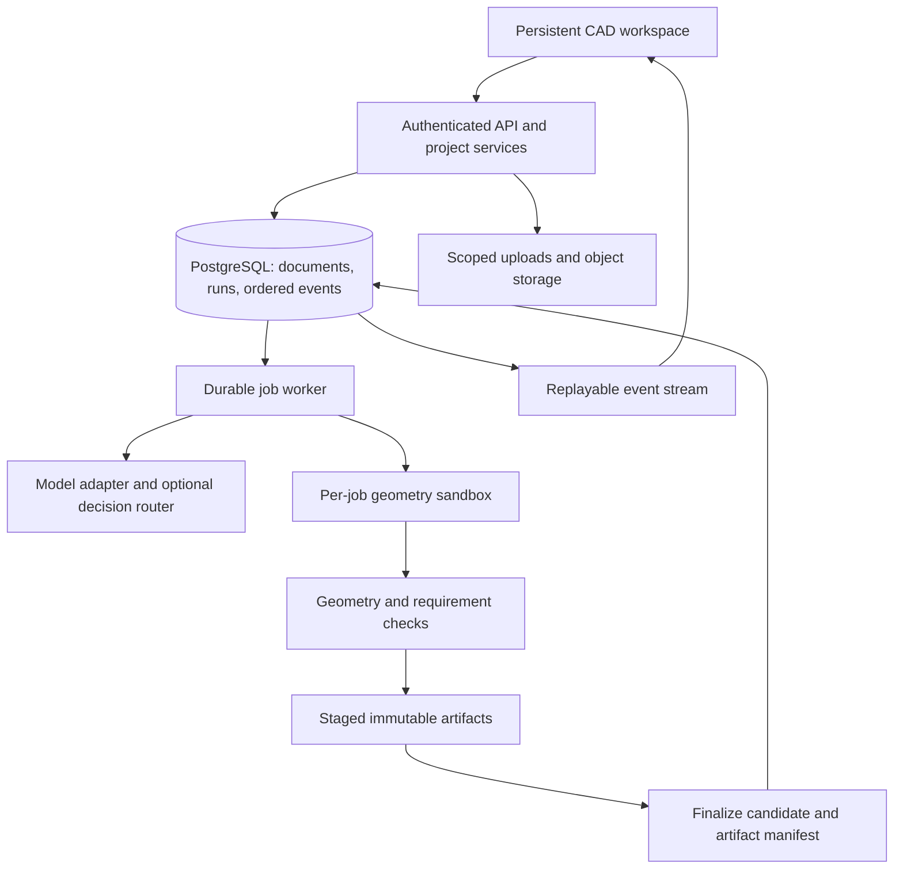

# CadPilot: product, UX, and backend target state

Research date: 24 September 2026. This is a proposed product direction and implementation roadmap, not a claim that the features below already exist.

## Product decision

CadPilot should help a designer turn an engineering requirement into an editable part, make successive changes without losing intent, and hand off a revision with explicit evidence about what was checked.

The initial audience should be individual hardware designers and small teams building brackets, enclosures, fixtures, adapters, and simple assemblies. This is an assumption to validate with users. It provides a tractable scope for geometry, editability, and manufacturing checks. Industrial surfacing, large assemblies, simulation, and full CAM would substantially expand the product and should follow demonstrated demand.

The differentiator should be the complete iteration loop: describe → inspect → select → edit → compare → export. Measure success by accepted, reusable designs and successful follow-up edits. A plausible first render is insufficient.

## Evidence and limits

This review inspected the current working tree, including uncommitted work; source takes precedence over older checklists. The repository already contains useful foundations: Next.js/React, PostgreSQL/Prisma, project ownership checks, revision lineage, a separate CAD worker, stored run events, artifact endpoints, and an embedded Chili3D editor using Replicad/OpenCascade outputs. Existing changes are preserved.

The UI/UX skill informed interaction, accessibility, and visual restraint. Its generic design-system search suggested a marketing layout that does not fit a CAD workspace; that layout was rejected. The workspace proposal below is a product-specific recommendation. No customer interviews, production telemetry, CAD accuracy benchmark, load test, or complete security audit was available. Proposed performance targets are acceptance goals, not measured results. Browser observations are recorded separately below when available.

### Current gaps verified in source

| Finding | Evidence | Consequence and priority |
|---|---|---|
| AI editing loses the executable representation after a manual edit | [Manual import](/home/manan/CadPilot/app/api/projects/[slug]/chili-import/route.ts) stores a comment as `sourceCode`; the [worker](/home/manan/CadPilot/scripts/cad-agent-worker.mjs:132) supplies only parent source to generation | The next AI edit lacks the saved geometry as an executable base. Fix before promising seamless mixed editing. P0. |
| Geometric success is overclaimed | [Build runtime](/home/manan/CadPilot/lib/cad/build-runtime.mjs:242) marks positive rounded volume and nonzero triangles valid; failed operations/parts can be skipped | A missing shell, missing part, or missing STEP can coexist with a valid revision. Separate build success, geometric validity, requirements, and export completeness. P0. |
| Cancellation is not enforced by execution | [Cancel endpoint](/home/manan/CadPilot/app/api/runs/[runId]/cancel/route.ts) changes records; [worker](/home/manan/CadPilot/scripts/cad-agent-worker.mjs:191) has no cancellation checkpoints and writes success unconditionally | A cancelled run can continue and overwrite terminal state. P0. |
| Some visible controls are incomplete | [Composer](/home/manan/CadPilot/components/projects/agent-composer.tsx) stores an attachment filename and local model selection but passes neither into submission; [workspace](/home/manan/CadPilot/components/projects/project-workspace.tsx:133) has Share and add-view buttons without handlers | Users cannot distinguish working features from placeholders. Implement or remove unsupported affordances. P0. |
| Stored history is not yet an effective editing control | [Workspace](/home/manan/CadPilot/components/projects/project-workspace.tsx:43) always selects `revisions[0]` and initializes an equal conversation/canvas split | Add an explicit active revision, compare/restore, and a model-focused layout. P1. |
| Planning lacks an engineering specification | [Worker](/home/manan/CadPilot/scripts/cad-agent-worker.mjs:63) uses empty dimensions and a fixed material; [plan route](/home/manan/CadPilot/app/api/projects/[slug]/runs/route.ts) creates a generic approval | The displayed plan does not establish what will actually be built. P0. |
| Plan-mode edits do not retain the base revision | [Approval route](/home/manan/CadPilot/app/api/agent-runs/[runId]/approval/route.ts:28) creates a job without `parentId`; pending approval in the workspace starts as local `null` | Edits may become fresh generations; a reload can hide the decision controls. P0. |
| “Blueprint” outputs are envelope illustrations | [Worker drawing functions](/home/manan/CadPilot/scripts/cad-agent-worker.mjs:85) draw bounding rectangles and labels | These are not projected engineering drawings. Relabel now, implement real projections later. P0 label correction; P2 drawing service. |
| Print readiness is inferred from incomplete evidence | [Preflight](/home/manan/CadPilot/app/api/projects/[slug]/revisions/[revisionId]/print-preflight/route.ts) infers watertightness from validity/volume and checks artifact presence | File availability does not prove printability. P0 label correction; P1 topology checks. |
| Event and revision allocation are inconsistent | [Worker](/home/manan/CadPilot/scripts/cad-agent-worker.mjs:43) uses count-plus-one for build events and revisions; some agent-event writers use serializable retries, others do not | Concurrent producers can collide. Allocate sequences and revisions atomically using shared logic. P0. |
| Streaming cleanup and resume are incomplete | [SSE route](/home/manan/CadPilot/app/api/runs/[runId]/events/route.ts) has an empty `cancel()`, interval polling, and an `after` query cursor without reading `Last-Event-ID` | Disconnects can leave polling active; reconnects replay unnecessarily; async polls can overlap. P0. |
| Revision publication can precede artifact completeness | Worker and manual import create valid revisions before sequential artifact writes | Failures may leave incomplete revisions visible or publishable. Stage and finalize atomically at the metadata boundary. P0. |
| Account recovery is unfinished | [Password reset](/home/manan/CadPilot/app/api/auth/password-reset/request/route.ts) logs codes instead of delivering email | Recovery cannot be treated as production-ready. P0 before external beta. |

These are source findings, not claims that every failure has been reproduced at runtime. Older checklist statements about completed cancellation, command parity, or preflight are not sufficient evidence of end-to-end behavior.

### Browser and screenshot evidence

Browser-agent work was delegated to a `gpt-5.6-luna` subagent following the user's instruction to use the cheapest available model for browser work. Initial requests returned `ERR_CONNECTION_REFUSED`; the subagent subsequently started the existing app, inspected `/`, `/projects`, and `/chili-editor`, and stopped its development server afterward. Startup succeeded without a reported compile blocker. No accounts, projects, builds, or source files were changed during the browser review.

Live desktop evidence:

- [Landing page](/home/manan/browser-agent/artifacts/screenshots/shot-20260924T184502-329.png): the headline and project CTA have clear hierarchy, but visible branding says “Agentic CAD” while the editor says “CadPilot.” Standardize the product name. The first screen emphasizes technical engine terminology; prioritize the user's editable-part outcome and show a complete example earlier.
- [Editor with tool search open](/home/manan/browser-agent/artifacts/screenshots/shot-20260924T184639-607.png): search opens successfully with visible focus, and the compact toolbar leaves substantial canvas space. The empty canvas lacks a central next-step prompt. Search exposes “Performance Test” and the vague “Toggle”; filter diagnostic commands from ordinary workflows and give ambiguous commands meaningful names. These are observed presentation issues; full command execution was not verified.

Existing screenshots additionally provide earlier responsive evidence:

- [Desktop workbench, 1280×720](/home/manan/CadPilot/output/playwright/unified-workbench-desktop.png): clear menus and toolbar, a largely empty canvas with weak first-use guidance, and substantial space occupied by Items/Properties.
- [Mobile workbench, 390×844](/home/manan/CadPilot/output/playwright/unified-workbench-mobile.png): toolbar wrapping reduces canvas height and the bottom constraint row appears clipped. Discoverability of object/property inspection needs live usability testing.

These observations support a focused empty state, more economical mobile controls, and explicit access to the inspector. The mobile observations were not reverified live. Authenticated project behavior and complete edit/save/export flows still require verification; screenshot appearance alone does not prove a control is functional or disabled.

## Lessons from comparable products

| Reference | Verified pattern | CadPilot recommendation |
|---|---|---|
| [Shapr3D adaptive UI](https://support.shapr3d.com/hc/en-us/articles/7873882619548-Adaptive-user-interface) | Selection changes the available modeling tools | Make selected geometry the shared context for tools, properties, and AI instructions. |
| [Onshape document management](https://cad.onshape.com/help/Content/Document/document_management.htm) and [comparison](https://cad.onshape.com/help/Content/Document/compare.htm) | Persistent history, immutable versions, recoverable workspaces, graphical comparisons | Preserve drafts automatically and make each accepted design recoverable and comparable. |
| [Fusion parameters](https://help.autodesk.com/view/fusion360/ENU/?contextId=SLD-MODIFY-PARAMETERS) | Named user and model parameters expose design control | Surface dimensions and expressions directly so simple edits do not require a chat round trip. |
| [Zoo Zookeeper](https://zoo.dev/research/zookeeper) | Conversational modeling works alongside graphical/code editing and selection context | Treat continuity of design intent across edits as a core architecture requirement. |

These are documented product patterns, not comparative usability or accuracy test results. CadPilot should validate its own version of them with its intended users.

## Ideal user journey

1. **Start with context.** Create from a requirement, a known parametric template, or imported geometry. Keep project naming optional until useful work exists. Offer examples with dimensions and intended use. Label STEP as imported geometry and STL as mesh; neither implies a recovered original feature tree.
2. **Establish the specification.** Display dimensions, units, material if known, manufacturing process if known, and assumptions. Ask only for missing facts that would materially change the design. Never silently invent a material or tolerance.
3. **Build a candidate.** Leave the accepted model visible while work runs. Show actual stages and elapsed time. A preview can appear early, but it must be labeled as a preview until precise geometry and checks finish.
4. **Review the result.** Show the new model with a short change summary and pass/fail/not-checked requirements. Selecting a finding highlights the affected geometry when a reliable reference exists.
5. **Edit naturally.** Select a face, hole, edge, part, or parameter; type “make this 2 mm thicker” or change a numeric value. A visible selection chip states exactly what the request targets. Unresolved references trigger clarification.
6. **Accept or restore.** Compare candidate and base using the same camera. Show dimension changes and added/removed bodies as well as a visual overlay. Accept a candidate explicitly or use an opt-in auto-accept policy for bounded, reversible parameter edits. New drafts preserve the previous accepted version.
7. **Prepare the handoff.** Export a pinned revision with units, scope, tessellation settings, and relevant check results. Share a specific revision with scoped access. Keep manufacturing preparation separate from basic file export.

Example acceptance journey: generate an enclosure with a 2 mm wall; manually add a mounting hole; ask AI to move that hole 5 mm; verify the wall and all unrelated geometry remain unchanged; export STEP; reimport and confirm the expected dimensions within the declared tolerance; restore the earlier revision.

## Workspace and visual design

Use one persistent workspace with the model occupying most of the screen. At a 1440 px desktop width, start with a 240 px model tree, an approximately 840 px canvas, and a 360 px contextual panel. These are prototype starting values. Allow resizing, collapse, and persistence per user. Avoid a permanent 50/50 conversation/canvas split once modeling starts.

```text
Project / revision · Draft saved                       Compare  Export  Share
----------------------------------------------------------------------------
Model tree           Modeling canvas                  Context panel
Parts / Features     Contextual tools                 Properties | Assistant
Parameters           Selection + dimensions           Selected: Hole 4
                     Orientation + section view       Diameter: 6 mm
                     Candidate/base overlay           Request + change card
----------------------------------------------------------------------------
History / versions                 mm · Save state · Geometry/check status
```

The left tree answers “what is this model made of?”; the right panel answers “what can I do with the selection?” Switch its contents rather than stacking multiple competing inspectors. During AI work, a compact persistent activity strip remains visible when Properties is open. Detailed execution logs live behind Activity. All panels refer to the same document, active revision, and selection.

**Visual direction.** Extend the existing quiet workbench tokens: neutral light surfaces, subtle dividers, blue for selection/actions, and restrained semantic colors. Offer a tested dark theme later without changing geometry color semantics. Use the existing system font, tabular numerals for measurements, 13–14 px compact desktop labels, and 15–16 px reading/input text. Use a 4 px spacing scale and modest corner radii. Heavy shadows, decorative gradients, and ornamental animation compete with geometry.

**Navigation.** Keep Projects, Model, History, and Export predictable. Provide command search with synonyms, shortcuts, and disabled-state explanations. Commands should reflect actual selection types, not only selection count. Label common actions in plain CAD terminology. “Open renderer” is an implementation detail; use “Fit model” or “Open model” only when those actions match the behavior.

**Selection.** Distinguish hover, selected, hidden, locked, and candidate geometry. Support selection filters and selection through the tree. Cross-highlight between the tree, viewport, measurements, change summary, and assistant. Preserve selection and camera when opening a report or changing panels. Make multi-selection explicit and provide “Clear selection.”

**Parameters.** Named fields need units, numeric bounds, expression support where implemented, and local validation. Show pending preview versus committed values. A failed change retains the last accepted geometry and places the error beside the relevant parameter. Maintain the difference between undoing a local action and restoring a saved revision.

**Assistant.** Use compact change cards: request, affected entities, assumptions, changed dimensions, validation evidence, and accept/discard. Detailed reports remain expandable. Show actual execution stages instead of presenting sequential helper functions as autonomous subagents. Expose model selection only if it changes real execution and users benefit from choosing it. A stop button must actually stop the run; attachments must upload and become explicit context.

**Projects and onboarding.** Show model thumbnails, last successful revision, save/run status, and recent activity. Add search and archive as the list grows. Let users resume a design in one action. The landing page should show a real editable example and the prompt-to-edit-to-export loop. Clearly distinguish illustrative renders from measured CAD outputs.

### State contracts that make the UX dependable

Track these independently: engine loading, mesh preview available, precise model loaded, local dirty state, draft saving, draft saved, build running, candidate ready, checks incomplete, save failure, and connection interrupted. A single `ready` flag cannot represent them.

Every asynchronous import/export carries a request ID and revision ID. Ignore stale results. A new AI result must not overwrite unsaved manual work: offer it as a candidate based on its original revision. Preserve a local recovery snapshot and reconcile it explicitly with server state on reload. Save errors leave a persistent recovery action, not only a disappearing toast.

### Responsive behavior and accessibility

Desktop prioritizes modeling. Tablet uses one dismissible side panel and touch-friendly selection. Phone prioritizes viewing, measurement, comments, approval, and export; full precision modeling should wait for a demonstrated usable interaction design. Do not simply stack a desktop transcript above an offscreen editor.

Provide keyboard navigation, visible focus, properly associated labels, command cancellation via Escape, and numeric alternatives to dragging. Panel resizing needs keyboard controls and click/tap size presets. The latter also supplies a non-drag pointer alternative. Test focus transitions across the engine iframe and never intercept text-editing shortcuts as CAD commands.

Use a WCAG 2.2 AA target: normal-text contrast of 4.5:1, non-color status indicators, and appropriately sized controls. The AA minimum target-size criterion is 24×24 CSS px with exceptions; 44×44 is a useful touch design goal, not the blanket AA minimum. See [W3C target size](https://www.w3.org/WAI/WCAG22/Understanding/target-size-minimum.html) and [dragging alternatives](https://www.w3.org/WAI/WCAG22/Understanding/dragging-movements.html). Provide a semantic tree, accessible measurements, and text descriptions of results alongside the graphical viewport. Validate actual operability rather than assuming ARIA makes all 3D interactions accessible.

## The core backend decision: one coherent design representation

The hardest problem is keeping graphical edits, AI edits, source, and geometry consistent. A STEP round trip preserves geometry but does not automatically preserve editable construction history. A generated JavaScript file is also not automatically a structured parametric model.

Adopt a versioned design document containing named parameters with units, feature/operation dependencies, stable part IDs, entity references, constraints, and provenance. Compile supported operations to the existing Replicad/OpenCascade runtime. Store evaluated geometry and artifacts against the document version. Both graphical commands and AI proposals should submit changes against this shared representation.

Deliver this incrementally:

1. Define source-backed, imported-BREP, and mesh-only revision capabilities. Store native editor snapshots if the pinned engine can reliably serialize and restore them. Verify that capability before promising it.
2. For imported geometry, preserve an immutable geometry asset as a base and apply supported operations to it. Do not pretend the original feature tree was recovered.
3. Introduce typed operations for the small core: parameters, sketches, extrude, revolve, boolean, transform, fillet/chamfer, shell, and patterns. Preserve raw source as a legacy/advanced representation with explicit capabilities.
4. Route more graphical commands through the shared document only after bidirectional round-trip tests pass. Keep unsupported engine edits as explicit imported-body checkpoints rather than fabricating source.

Persistent face/edge references require dedicated engineering. Raw face indices can change after booleans or regeneration. Use feature-owned references and kernel history where available, plus explicit remapping/ambiguity detection. Stop the edit when a reference cannot be resolved reliably; never choose a vaguely similar face silently.

### Suggested domain model

| Entity | Responsibility |
|---|---|
| Workspace / Membership | Team boundary and owner/editor/reviewer/viewer permissions |
| Project / DesignDocument | Current draft head, schema version, units, document metadata |
| Revision | Immutable document snapshot, parent, author, origin, accepted/candidate status |
| GeometryAsset | Imported/evaluated BREP or mesh, checksum, format and capability metadata |
| Parameter / Feature / Constraint | Structured intent, dependencies, units, stable identifiers |
| Run / Attempt / Step / Event | Execution lifecycle, retries, ordered events, leases, cancellation |
| ChangeProposal | Base revision, proposed changes, evidence, accept/discard state |
| ValidationCheck | Check ID/version, pass/fail/unknown/not-applicable, measured/expected values |
| Artifact / ExportJob | Revision-derived files, checksums, ready state, format settings |
| ReviewComment / ShareGrant | Revision or entity anchors, expiry/revocation, access scope |
| UsageLedger | Model/kernel/storage usage and attributed costs |

These are logical responsibilities; do not create all tables immediately. Extend the existing project/revision/run schema first. Parameter and feature data may initially live in a schema-validated document. Explicit schemas and migrations matter more than prematurely normalizing every field.

## Execution architecture

Keep the current stack and a modular application. Separate long-running execution and trust boundaries without immediately introducing a large microservice estate.



**Job lifecycle.** Specify guarded transitions: queued → planning → executing → validating → candidate-ready, with explicit waiting-for-input, failed, and cancelled states. Separate computation completion from the user accepting a design. Bind plans and approvals to a base revision and plan hash. Persist enough state to resume after reload or worker restart.

**Leases and retries.** Each claim needs an attempt ID, lease expiry, heartbeat, and fencing token. Reclaim expired work safely. Retry transient provider failures with bounded backoff, and repair geometry under an independent attempt/cost budget. Assume at-least-once delivery; make effects idempotent. A duplicate request must not produce duplicate accepted revisions or usage charges inside the application ledger.

**Cancellation.** Mark a cancellation request, abort provider calls where supported, and terminate the per-job geometry process when necessary. Check cancellation/fencing before committing any result. Late responses may be recorded for diagnostics but cannot change a cancelled run to successful. Display “Stopping” until the worker acknowledges.

**Events.** Use one append operation for monotonically ordered run events across worker, approvals, cancellation, and retries. Keep sequence ordering in the client rather than relying on timestamps. Support `Last-Event-ID`, heartbeat comments, bounded replay, pagination, snapshot reconciliation, and abort cleanup. SSE remains adequate for run progress; use WebSockets later if live presence/editing requires bidirectional traffic.

**Artifact completion.** Write files to attempt-scoped staging keys, verify checksums and a required-artifact manifest, then commit ready metadata and the revision reference in a database transaction. Object storage and the database are not one atomic transaction: retain cleanup/reconciliation jobs for orphaned staging data and incomplete commits. Use immutable object keys and explicit export versions.

**Isolation.** Move geometry execution and untrusted STEP/mesh parsing out of request handlers into bounded jobs. The model orchestration process can reach providers; geometry execution gets no model/DB secrets or network egress. Enforce CPU, memory, filesystem, and wall-clock limits outside JavaScript. Node explicitly says [`node:vm` is not a security mechanism](https://nodejs.org/api/vm.html); keyword restrictions are only additional checks.

**Storage and access.** Introduce an object-storage adapter, scoped upload limits, MIME/format validation, authorization on every artifact, and short-lived download grants. Pin shared links to revisions, make access revocable, and distinguish private sharing from public publication. Add backup/restore drills, retention policies, account deletion handling, real recovery email, rate limits, and cookie-auth mutation protections before broader release.

**Observability and cost.** Correlate request, run, attempt, revision, model, and artifact IDs. Record queue delay, provider latency, geometry time, repair rate, cancellations, import/export failures, peak memory, and cost per accepted design. Record model and kernel versions for reproducibility. Add per-user concurrency and spend limits, bounded output sizes, and an operator view for failed/stuck work. Do not log raw secrets or recovery codes.

**Framework choices.** Preserve Next.js, React, Prisma, PostgreSQL, and the existing CAD stack unless measured constraints justify changes. A reliable PostgreSQL-backed worker can serve the first stage. Re-evaluate a durable workflow engine when resumable multi-step execution and operational complexity exceed the current worker's maintainability. Pin supported runtime/dependency versions and test upgrades; adding a new orchestration framework alone does not establish correct cancellation or idempotency.

## Validation and manufacturing features

Replace a single quality score with independent evidence:

| Layer | Required evidence | User-facing result |
|---|---|---|
| Execution | Supported operations completed; required features/parts present | Built / partially built / failed |
| Geometry | Kernel shape validity, solid/shell classification, finite measurements, relevant topology checks | Geometry checks passed / failed / not checked |
| Requirements | Requested dimensions, counts, relationships, clearances and tolerances compared to actual geometry | Each requirement independently passed/failed/unknown |
| Export | Required bodies represented; reimport succeeds; dimensions and units preserved within declared tolerance | STEP/STL/3MF check results by format |
| Manufacturing | Process-specific checks with a selected machine/material/profile | Preflight findings, assumptions, and unchecked properties |

Use kernel validity analysis where supported by the deployed binding, with a native worker adapter if necessary. [OpenCascade's documented validity framework](https://dev.opencascade.org/doc/occt-7.3.0/refman/html/annotated.html) illustrates the distinction between a measurable shape and a checked shape; this reference is conceptual, not verification that every API exists in the current WASM build.

Treat failure of a requested shell or hole as a failed requirement, even if a solid remains. A skipped decorative fillet may be a visible warning only under an explicit policy. Do not force every assembly part to touch: legitimate clearances and exploded views exist. Validate against assembly intent.

Keep precise measurements unrounded internally. Identify mesh-derived approximations separately from BREP measurements. Avoid summing overlapping body volumes as if that necessarily describes the physical assembly's occupied volume.

For FDM, add actual mesh manifold/watertight checks, degenerate faces, connected components, dimensions/build-volume checks, scale, and orientation. Later add wall/clearance and overhang analysis with printer/material assumptions. STL must remain exportable when 3MF is absent. A 3MF container is not a printer-specific sliced job; do not claim print-ready G-code without a slicer and machine profile.

Real drawings need orthographic projections, section/hidden-line support, associative dimensions, and revision-linked annotations. Start with reliable projected views and basic dimensions; label unsupported drawing capabilities. CNC checks, sheet metal, joints, motion, BOMs, and simulation belong to subsequent scoped tracks with explicit validation criteria.

## Where Jev and Laya belong

A correction to the earlier discussion: `jevmodel.org` is an independent site. The official TypeSafe quickstart specifies `https://api.typesafe.ai/v1/systemone` and keys from its own console. Use [TypeSafe's official integration documentation](https://docs.typesafe.ai/introduction/quickstart).

Jev's typed decisions are useful for routing an instruction, detecting ambiguous references, choosing a relevant reference document, and classifying recoverable failures. Ask narrow questions and combine answers in application logic, as described in the [official introduction](https://docs.typesafe.ai/introduction). These are proposed CadPilot uses, not measured performance here.

Keep exact dimensions, permissions, cancellation, geometry validity, and export completeness deterministic. A decision model should not certify a CAD result or approve manufacturing. Choose tools directly from deterministic selection rules when those suffice.

Laya is an independent open-source decision model with English, multilingual, and typed-decision checkpoints. Its [upstream repository](https://github.com/NandhaKishorM/laya) documents short context limits, checkpoint-dependent behavior, and current weaknesses including label sensitivity and scoring bias. Evaluate it as a model to specialize on a stable task. Published local inference times are not end-to-end CadPilot latency measurements.

Start without making either provider mandatory. Collect a labeled routing dataset; compare deterministic rules, the existing model, Jev, and Laya on a held-out set. Measure per-class errors, abstention/coverage, calibration, total latency, operational cost, and downstream edit failures. Use shadow decisions first, then permit low-impact routing where evidence supports it. Revert routing on outages or regressions.

Do not copy a universal 0.85 threshold. Jev's `confidence` is derived from its distribution; it is not automatically an empirical probability of correctness on CAD requests. `noul` represents the proposition's probability and has no separate confidence field. See [TypeSafe confidence documentation](https://docs.typesafe.ai/confidence). Keep ambiguous decisions on a fallback path and tune thresholds by action and error cost.

## Delivery order and acceptance gates

| Stage | Scope | Exit evidence |
|---|---|---|
| P0 — truthful, recoverable core | Fix cancellation, incomplete controls, parent lineage in plan mode, pending-plan reload, event cleanup/order, numbering races, artifact finalization, accurate validation/drawing labels; isolate geometry execution before external untrusted use | Cancellation cannot later publish; refresh restores pending work; duplicate requests and concurrent saves do not corrupt revisions; partial exports never appear complete |
| P1 — dependable daily modeling | Persistent canvas layout, shared selection, named parameters, draft recovery, candidate compare/accept, source/import capability contract, initial typed operations, basic topology and requirement checks | The enclosure/manual-hole/AI-move/export/restore journey passes repeatedly with exact requirements and no unrelated changes |
| P2 — useful handoffs and teams | Robust uploads, object storage, scoped sharing, reviewer comments, revision comparison, credible print preparation, genuine drawings, team roles and usage visibility | A second user can review a pinned revision; access revocation works; exports reimport correctly; manufacturing findings show evidence and limits |
| P3 — evidence-driven expansion | Better assemblies, constraints/joints, configuration families, BOMs, drawing depth, specialized model routing, optional fine-tuning, integrations | User research and benchmark results justify each feature; adoption and task success improve without sacrificing reliability |

Stage order is dependency-based; calendar estimates require team capacity and an engine capability spike. Keep geometrical editing and representation work as an explicit technical track rather than burying it in UI polish.

### Proposed acceptance budgets

For a declared reference laptop, browser, network profile, and model corpus: local interaction feedback within 100 ms; cached project preview usable within 2 seconds; representative small-model navigation aiming for 60 fps and remaining usable at 30 fps; simple parameter updates within 1 second where the kernel permits. Report p50/p95 and model complexity, not just averages. Establish generation latency goals only after measuring provider and kernel time separately.

Reliability gates are stronger than speed goals: no late success after cancellation, no accepted revision missing required artifacts, no unnoticed loss of manual edits, and no automatic “passed” result for an unchecked requirement.

## How to validate the product direction

Recruit an initial 6–8 participants spanning target mechanical designers and less experienced hardware builders. Treat this as formative research, not statistically conclusive evidence. Observe creation from a dimensioned brief, an ambiguous edit, a selected-face modification, a failed operation, compare/restore, and export/reimport.

Prototype the canvas-dominant layout against the current conversation split; counterbalance task order. Record completion, errors, wrong-target edits, help requests, and whether users can explain what was validated and saved. Ask users to identify the exact revision being exported. Only run a quantitative A/B test when traffic and a power calculation support it.

Build a versioned CAD evaluation corpus before expanding model autonomy: known dimensions/units, holes and shells, repeated features, imported STEP, mesh-only inputs, multi-part clearances, missing requirements, sequential manual/AI edits, and adversarial or malformed input. Hold out examples from prompt tuning. Track first-pass requirement success, repair success, preservation of unaffected geometry, export fidelity, and cost per accepted result.

Meaningful engineering tests should cover state transitions, cross-project permissions, duplicate submission, worker death/lease recovery, cancellation during generation and geometry execution, expired approvals, stream disconnect/replay, partial object-storage failure, stale import responses, and conflicting saves. Add representative browser flows and keyboard checks. A production build is useful but does not prove any of these behaviors.

The next concrete milestone should be one reliable end-to-end part workflow with recoverable mixed editing, explicit checks, and verified export. That provides a defensible foundation for the broader platform.

### Metrics to make the roadmap accountable

Instrument the path from project creation to first accepted revision, successful second edit, verified export, and a return session. Report task completion and failure by input type, model family, and geometry complexity. Use time to first usable part and preservation of intent after follow-up edits as activation measures. Track the proportion of projects users return to and successfully revise, rather than rewarding raw generation volume.

Pair adoption with reliability and cost: rollback frequency, manual-edit loss incidents, failed saves, cancellation latency, support reports, and total compute/storage cost per accepted revision. Ask for lightweight feedback on a failed change with the relevant revision attached only under the user's data-sharing preference. Separate consented evaluation data from private project data.

For an initial product, paid value is dependable editing, private projects, useful exports, and collaboration. Evaluate pricing only after measuring cost and willingness to pay. Show allowance/estimated usage before unusually expensive work, and preserve access to existing designs when a generation quota is exhausted.
